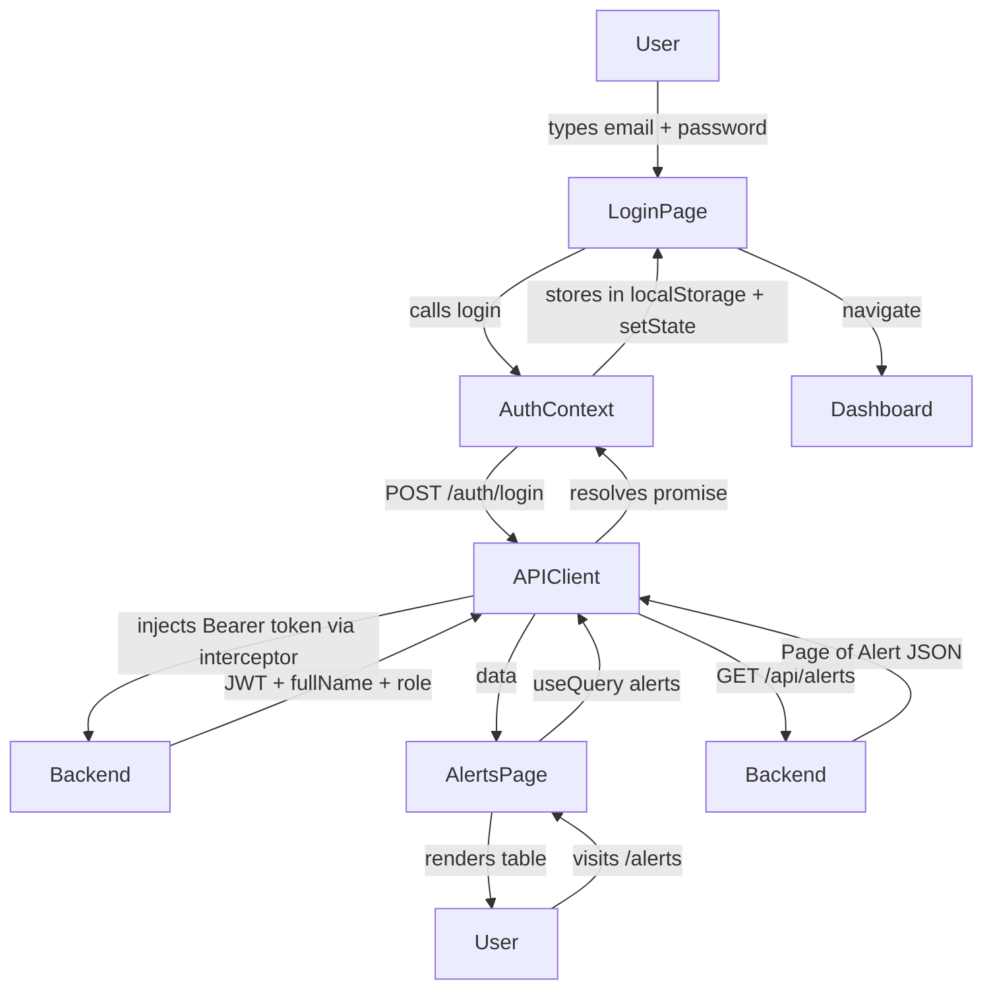
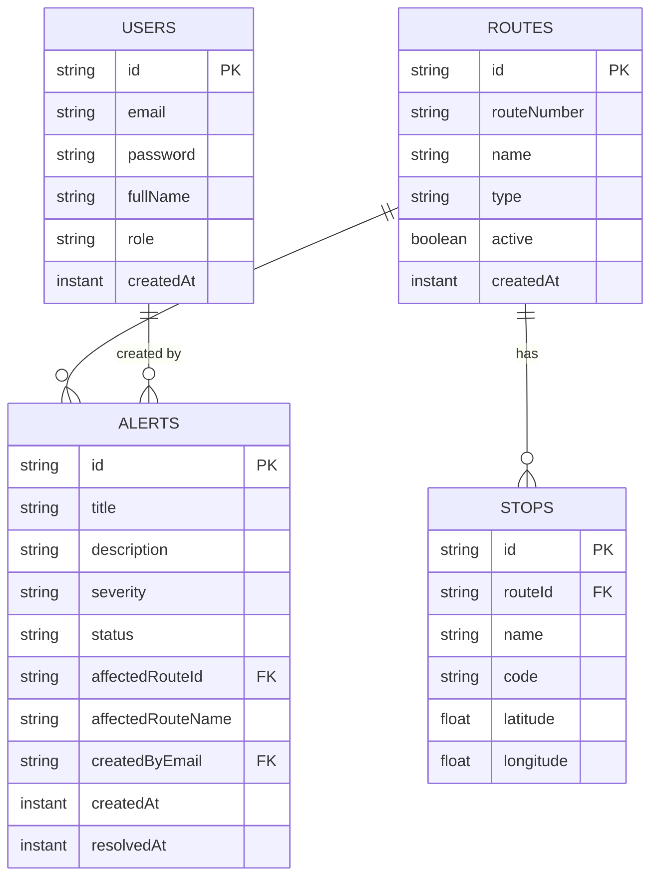
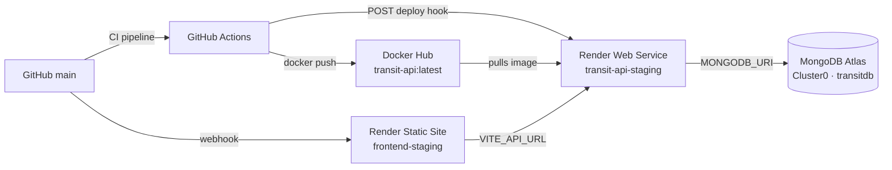
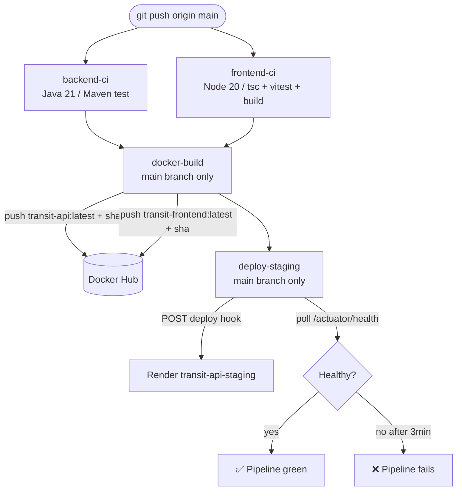
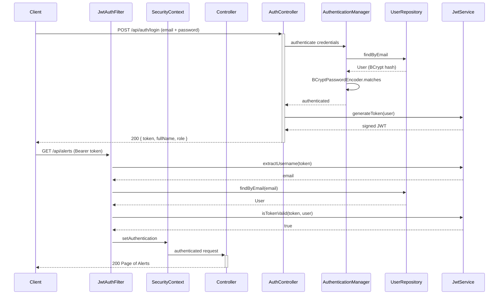

# Interview Talking Points — Transit Alert Dashboard

> Generated from workspace: `transit-alert-dashboard`
> Source of truth: `docs/jd-practice-plan.md`
> Target JD: Full Stack Software Engineer — Java | React | MongoDB | TypeScript (Jobot, mobility/transportation tech, $55–60/hr contract-to-hire)

---

# 1. Project Summary

"I built a full-stack transit operations dashboard as a hands-on interview practice project targeting a Java / React / MongoDB role. The app is an internal tool for transit agency operators: they log in, see a live summary of service disruptions, create and resolve alerts for things like signal failures or detours, and browse the route network. Under the hood it's a Spring Boot 3 REST API backed by MongoDB, with a React 18 TypeScript frontend built with Vite and TailwindCSS. The whole thing is containerized with Docker, tested with JUnit and Vitest, and deployed automatically to Render's free tier via GitHub Actions CI. I chose the transit domain specifically because the target company builds software for public transit agencies — so it mirrors the kind of features I'd be working on day one."

---

# 2. Actual Tech Stack Found

| Area | Technology Found | Evidence From Workspace | Interview Explanation |
|---|---|---|---|
| **Backend Language** | Java 21 | `pom.xml` `<java.version>21</java.version>` | "Java 21 with virtual threads available; I used standard platform threads but the upgrade path is clear." |
| **Backend Framework** | Spring Boot 3.5 | `pom.xml` parent `3.5.0` | "Spring Boot 3 with the full autoconfiguration stack — Web, Security, Data MongoDB, Actuator, Validation." |
| **Database** | MongoDB 7 | `docker-compose.yml` `image: mongo:7`, `application.yml` Spring Data MongoDB URI | "Document database chosen for flexible hierarchical transit data — routes, stops, and alerts all have different shapes." |
| **Frontend Framework** | React 18 + TypeScript | `package.json` `react: ^18.3.1`, `typescript: ^5.4.5` | "React 18 SPA written entirely in TypeScript — all component props and API response shapes are typed." |
| **Frontend Build** | Vite 5 | `package.json` `vite: ^5.3.1`, `vite.config.ts` | "Vite gives sub-second hot-reload in dev and fast production builds with tree-shaking." |
| **Styling** | TailwindCSS 3 | `package.json`, `tailwind.config.js` | "Utility-first CSS — no separate stylesheet files, every component is self-contained." |
| **Server State** | TanStack React Query 5 | `package.json` `@tanstack/react-query: ^5.51.1` | "React Query manages caching, refetching, and loading states — I don't need a global Redux store for server data." |
| **HTTP Client** | Axios | `package.json` `axios: ^1.7.2`, `src/api/client.ts` | "Axios with request interceptor for JWT injection and response interceptor for 401 redirect." |
| **Auth** | JWT (JJWT 0.12.5) + Spring Security | `pom.xml` jjwt dependencies, `JwtService.java`, `SecurityConfig.java` | "Stateless JWT auth — signed with HMAC-SHA, validated on every request by a custom `OncePerRequestFilter`." |
| **Container** | Docker + Docker Compose | `backend/Dockerfile`, `frontend/Dockerfile`, `docker-compose.yml` | "Multi-stage Dockerfiles — Maven build stage + JRE runtime stage for backend; Node build + nginx for frontend." |
| **CI/CD** | GitHub Actions | `.github/workflows/ci.yml` | "4-job pipeline: backend tests, frontend tests (parallel), Docker build & push, deploy to Render staging." |
| **Cloud** | Render.com + MongoDB Atlas | `docs/render-mongodb-staging-setup.md` | "Backend runs as an image-based Web Service on Render; database is MongoDB Atlas M0 free cluster." |
| **Backend Testing** | JUnit 5 + Mockito | `AlertServiceTest.java` | "Unit tests for every service method using `@ExtendWith(MockitoExtension.class)` — no Spring context needed." |
| **Frontend Testing** | Vitest + React Testing Library | `LoginPage.test.tsx`, `AlertStatusBadge.test.tsx` | "Component tests simulate real user interactions via `userEvent` — test behavior, not implementation." |
| **API Documentation** | Springdoc / Swagger UI | `pom.xml` springdoc dep, `application.yml` swagger config | "Swagger UI auto-generated from code — tryable from the browser with Bearer token support." |
| **Component Docs** | Storybook 8 | `package.json` storybook deps, `src/stories/` | "Storybook stories for Layout and LoginPage — isolated visual development and component documentation." |

---

# 3. Main Features Implemented

| Feature | Files / Modules Involved | Skill Demonstrated | How To Explain It |
|---|---|---|---|
| JWT Login | `AuthController.java`, `JwtService.java`, `JwtAuthFilter.java`, `LoginPage.tsx`, `AuthContext.tsx` | Spring Security, JWT, React state | "Login returns a signed JWT; a custom filter validates it on every subsequent request. Token stored in localStorage, injected by Axios interceptor." |
| Alert CRUD | `AlertController.java`, `AlertService.java`, `AlertRepository.java`, `AlertRequest.java`, `AlertsPage.tsx`, `CreateAlertPage.tsx` | REST API, MongoDB CRUD, pagination, React Query | "Full create / read / resolve / delete lifecycle. List endpoint supports status + routeId filters and pagination." |
| Alert Resolution (idempotent) | `AlertService.resolve()` | Idempotent API design | "PATCH `/alerts/{id}/resolve` sets status to RESOLVED and stamps `resolvedAt`. Calling it twice is safe — already-resolved alerts are returned unchanged." |
| Dashboard Summary | `AlertService.summary()`, `DashboardPage.tsx` | MongoDB aggregation (count), React Query | "Summary endpoint counts active vs resolved alerts; dashboard shows live counters with links to filtered views." |
| Route Management | `RouteController.java`, `RouteService.java`, `RouteRepository.java`, `RoutesPage.tsx` | Full CRUD, indexed unique field | "Routes have a unique `routeNumber` index. Alerts hold a denormalized `affectedRouteName` to avoid joins on every read." |
| Global Error Handling | `GlobalExceptionHandler.java` | `@RestControllerAdvice`, RFC 7807 ProblemDetail | "One handler for all exception types — returns structured ProblemDetail JSON with correct HTTP status codes." |
| Input Validation | `AlertRequest.java` (`@NotBlank`, `@NotNull`) | Jakarta Bean Validation | "Controller boundary validation — malformed requests are rejected before reaching service logic." |
| MongoDB Compound Index | `Alert.java` `@CompoundIndex` | Database performance, query optimization | "Compound index on `(status, affectedRouteId, createdAt DESC)` covers the most common filter + sort pattern." |
| Data Seeding | `DataSeeder.java` | `@EventListener`, safe idempotent seed | "Seeds three demo users (ADMIN, OPERATOR, VIEWER) plus sample routes and alerts on first startup. Safe to restart." |
| Multi-stage Docker Build | `backend/Dockerfile`, `frontend/Dockerfile` | Docker best practices, image size | "Build stage compiles; runtime stage copies only the JAR into a lean JRE image. Frontend uses nginx to serve `dist/`." |
| GitHub Actions CI/CD | `.github/workflows/ci.yml` | CI/CD, Docker Hub push, Render deploy hook | "Tests run in parallel jobs; Docker push and staging deploy only trigger on `main` after both test jobs pass." |
| CORS via @Value | `SecurityConfig.java` | Spring Security CORS, env var injection | "CORS allowed origins are injected at startup via `@Value(\"${FRONTEND_URL}\")` so the staging URL is read from the environment." |
| Storybook | `src/stories/` | Component documentation, isolated development | "Stories for Layout and LoginPage document the components visually, independent of the running app." |

---

# 4. JD Skill Mapping

---

### Java

#### JD Skill
Java — primary backend language

#### What I Built
A Spring Boot 3.5 REST API in Java 21, following a layered controller → service → repository architecture across alerts, routes, stops, and users domains.

#### Example Code
```java
@Service
@RequiredArgsConstructor
public class AlertService {

    private final AlertRepository alertRepository;
    private final RouteRepository routeRepository;

    public Alert create(AlertRequest req) {
        String routeName = routeRepository.findById(req.affectedRouteId())
                .map(r -> r.getName())
                .orElseThrow(() -> new NotFoundException("Route not found: " + req.affectedRouteId()));

        String createdBy = SecurityContextHolder.getContext().getAuthentication().getName();

        Alert alert = Alert.builder()
                .title(req.title())
                .description(req.description())
                .severity(req.severity())
                .status(AlertStatus.ACTIVE)
                .affectedRouteId(req.affectedRouteId())
                .affectedRouteName(routeName)
                .createdByEmail(createdBy)
                .createdAt(Instant.now())
                .build();
        return alertRepository.save(alert);
    }
}
```

#### How To Explain It
"The backend is Java 21 with Spring Boot 3. I separated concerns into controller, service, and repository layers. The `AlertService` validates the route exists, reads the authenticated user from `SecurityContextHolder`, builds the document with the builder pattern, and delegates persistence to the repository. This structure maps directly to how teams in Java shops organize production code."

---

### React

#### JD Skill
React — primary frontend framework

#### What I Built
A React 18 SPA with five pages (Login, Dashboard, Alerts, Alert Detail, Routes), client-side routing via React Router 6, and TanStack React Query for server state management.

#### Example Code
```typescript
export default function AlertsPage() {
  const [statusFilter, setStatusFilter] = useState<AlertStatus | ''>('')
  const [page, setPage] = useState(0)
  const queryClient = useQueryClient()

  const { data, isLoading } = useQuery({
    queryKey: ['alerts', { status: statusFilter, page }],
    queryFn: () =>
      alertsApi.list({ status: statusFilter || undefined, page, size: 10 }),
  })

  const resolveMutation = useMutation({
    mutationFn: alertsApi.resolve,
    onSuccess: () => queryClient.invalidateQueries({ queryKey: ['alerts'] }),
  })
```

#### How To Explain It
"The frontend is React 18 with TypeScript. I used TanStack React Query to manage server state — it handles caching, background refetching, and loading states without a global Redux store. When an operator resolves an alert, the mutation's `onSuccess` callback invalidates the `alerts` query key, which triggers an automatic refetch of the list."

---

### TypeScript

#### JD Skill
TypeScript — typed JavaScript layer on frontend

#### What I Built
The entire frontend is TypeScript. Shared DTO types in `src/types/index.ts` mirror the backend response shapes so any API contract change is caught at compile time.

#### Example Code
```typescript
export const alertsApi = {
  list: (params: {
    status?: AlertStatus
    routeId?: string
    page?: number
    size?: number
  }) => api.get<Page<Alert>>('/alerts', { params }).then((r) => r.data),

  create: (req: AlertRequest) => api.post<Alert>('/alerts', req).then((r) => r.data),

  resolve: (id: string) => api.patch<Alert>(`/alerts/${id}/resolve`).then((r) => r.data),
}
```

#### How To Explain It
"I wrote the entire frontend in TypeScript, including the API client, component props, and context values. The `alertsApi` functions are generic — `api.get<Page<Alert>>` means the return type is inferred end-to-end. If I renamed a field on the backend DTO, TypeScript would flag every usage site in the frontend at compile time, not at runtime in production."

---

### MongoDB

#### JD Skill
MongoDB — primary database

#### What I Built
Four MongoDB collections — users, routes, stops, alerts — using Spring Data MongoDB repositories. Alerts have a compound index on `(status, affectedRouteId, createdAt)` and a denormalized `affectedRouteName` for read performance.

#### Example Code
```java
@Document(collection = "alerts")
@CompoundIndexes({
    @CompoundIndex(name = "status_route_created_idx",
                   def = "{'status': 1, 'affectedRouteId': 1, 'createdAt': -1}")
})
@Getter @Setter @NoArgsConstructor @AllArgsConstructor @Builder
public class Alert {
    @Id
    private String id;
    private AlertSeverity severity;   // LOW, MEDIUM, HIGH
    private AlertStatus status;       // ACTIVE, RESOLVED
    private String affectedRouteId;   // FK to routes collection
    private String affectedRouteName; // denormalized for display speed
    private Instant createdAt;
    private Instant resolvedAt;
}
```

#### How To Explain It
"I chose MongoDB because transit data has a flexible, hierarchical shape — alerts reference routes, which reference stops. The compound index on `(status, affectedRouteId, createdAt DESC)` covers the most common query pattern: filter by status and route, sort newest first. I also denormalized `affectedRouteName` into the alert document to avoid a lookup on every list read — a classic read-performance trade-off in document databases."

---

### REST API Design

#### JD Skill
REST API design — CRUD endpoints, pagination, filtering

#### What I Built
RESTful endpoints following standard conventions: paginated list with optional filters, resource creation returning `201 Created` with `Location` header, idempotent PATCH for state transitions, and `204 No Content` for deletes.

#### Example Code
```java
@GetMapping
public Page<Alert> list(
        @RequestParam(required = false) AlertStatus status,
        @RequestParam(required = false) String routeId,
        @RequestParam(defaultValue = "0") int page,
        @RequestParam(defaultValue = "10") int size) {
    return alertService.findAll(status, routeId,
            PageRequest.of(page, size, Sort.by(Sort.Direction.DESC, "createdAt")));
}

@PostMapping
public ResponseEntity<Alert> create(@Valid @RequestBody AlertRequest req) {
    Alert created = alertService.create(req);
    return ResponseEntity.created(URI.create("/api/alerts/" + created.getId())).body(created);
}

@PatchMapping("/{id}/resolve")
public Alert resolve(@PathVariable String id) {
    return alertService.resolve(id);
}
```

#### How To Explain It
"I designed the API following REST conventions. GET `/alerts` supports optional `status` and `routeId` query params for filtering, plus `page` and `size` for pagination — no unbounded result sets. POST returns `201 Created` with a `Location` header pointing to the new resource. PATCH `/alerts/{id}/resolve` is idempotent — resolving an already-resolved alert is a no-op."

---

### JWT Authentication

#### JD Skill
JWT or OAuth-based authentication

#### What I Built
Stateless JWT auth: login endpoint issues a signed HMAC-SHA256 token; `JwtAuthFilter` (extends `OncePerRequestFilter`) validates it on every request and populates `SecurityContextHolder`.

#### Example Code
```java
@Override
protected void doFilterInternal(
        @NonNull HttpServletRequest request,
        @NonNull HttpServletResponse response,
        @NonNull FilterChain filterChain) throws ServletException, IOException {

    String authHeader = request.getHeader("Authorization");
    if (authHeader == null || !authHeader.startsWith("Bearer ")) {
        filterChain.doFilter(request, response);
        return;
    }

    String token = authHeader.substring(7);
    String username = jwtService.extractUsername(token);

    if (username != null && SecurityContextHolder.getContext().getAuthentication() == null) {
        userRepository.findByEmail(username).ifPresent(user -> {
            if (jwtService.isTokenValid(token, user)) {
                var auth = new UsernamePasswordAuthenticationToken(
                        user, null, user.getAuthorities());
                auth.setDetails(new WebAuthenticationDetailsSource().buildDetails(request));
                SecurityContextHolder.getContext().setAuthentication(auth);
            }
        });
    }
    filterChain.doFilter(request, response);
}
```

#### How To Explain It
"Authentication is stateless JWT. The filter extracts the Bearer token from the Authorization header, validates the signature and expiry using JJWT, loads the user from MongoDB, and sets the authentication in `SecurityContextHolder`. No session state exists on the server — every request is self-contained. The frontend stores the token in localStorage and injects it via an Axios request interceptor."

---

### Software Testing

#### JD Skill
Software testing strategies — unit and component tests

#### What I Built
JUnit 5 + Mockito unit tests for `AlertService` covering create, resolve, idempotency, and summary; Vitest + React Testing Library component tests for `LoginPage` and `AlertStatusBadge`.

#### Example Code
```java
@Test
void resolve_isIdempotent_whenAlreadyResolved() {
    activeAlert.setStatus(AlertStatus.RESOLVED);
    when(alertRepository.findById("alert-1")).thenReturn(Optional.of(activeAlert));

    Alert result = alertService.resolve("alert-1");
    assertThat(result.getStatus()).isEqualTo(AlertStatus.RESOLVED);
    verify(alertRepository, never()).save(any());
}
```

#### How To Explain It
"I wrote unit tests for every `AlertService` method using JUnit 5 and Mockito — no Spring context is loaded, so tests run in milliseconds. The idempotency test specifically verifies that resolving an already-resolved alert skips the `save()` call entirely. On the frontend, React Testing Library tests simulate real user interactions — typing into fields and clicking buttons — so I'm testing behavior, not implementation details."

---

### Docker / Containerization

#### JD Skill
Docker / containerization

#### What I Built
Multi-stage Dockerfiles for both backend (Maven build → JRE runtime, non-root user) and frontend (Node build → nginx static server). `docker-compose.yml` orchestrates all four services with health checks and a named volume.

#### Example Code
```dockerfile
# --- Build stage ---
FROM maven:3.9.7-eclipse-temurin-21 AS build
WORKDIR /app
COPY pom.xml .
COPY src ./src
RUN mvn package -DskipTests -q

# --- Runtime stage ---
FROM eclipse-temurin:21-jre-jammy
WORKDIR /app
RUN addgroup --system appgroup && adduser --system --ingroup appgroup appuser
COPY --from=build /app/target/*.jar app.jar
USER appuser
EXPOSE 8080
ENTRYPOINT ["java", "-jar", "app.jar"]
```

#### How To Explain It
"The backend Dockerfile has two stages. The build stage uses the full Maven image to compile the JAR. The runtime stage copies only the JAR into a lean JRE image and runs it as a non-root `appuser`. This keeps the final image small and removes build tools from the production image — a standard security practice. `docker compose up --build` brings up MongoDB, the API, the frontend, and Mongo Express with one command."

---

### CI/CD Pipelines

#### JD Skill
CI/CD pipelines — GitHub Actions

#### What I Built
A 4-job GitHub Actions pipeline: `backend-ci` and `frontend-ci` run in parallel on every push; `docker-build` pushes images to Docker Hub only on `main` after both pass; `deploy-staging` fires the Render deploy hook and polls the health endpoint.

#### Example Code
```yaml
deploy-staging:
  name: Deploy → Staging
  runs-on: ubuntu-latest
  needs: [docker-build]
  if: github.ref == 'refs/heads/main'
  environment:
    name: staging
    url: https://transit-api-staging.onrender.com

  steps:
    - name: Wait for staging health check
      run: |
        for i in $(seq 1 18); do
          STATUS=$(curl -s -o /dev/null -w "%{http_code}" \
            https://transit-api-staging.onrender.com/api/actuator/health)
          if [ "$STATUS" -eq 200 ]; then
            echo "✅ Staging health check passed (attempt $i)"
            exit 0
          fi
          echo "Attempt $i/18 — HTTP $STATUS — retrying in 10s..."
          sleep 10
        done
```

#### How To Explain It
"The pipeline has four jobs. Backend and frontend tests run in parallel — neither blocks the other. Docker build and staging deploy only run on `main` and only after both test jobs pass. The deploy job fires the Render deploy hook then polls `/actuator/health` up to 18 times over 3 minutes — if staging never becomes healthy, the job fails and the team is notified. This mirrors a real CD safety check."

---

### Agile Development

#### JD Skill
Agile development principles and methodologies

#### What I Built
Work was tracked as GitHub Issues linked to pull requests; conventional commits enforce structured commit messages; CI gates merges on passing tests.

#### Example Code
*(process — no code snippet)*

#### How To Explain It
"I treated this project like a sprint-based Agile workflow. Each feature was a GitHub Issue; commits follow conventional commit format (`feat:`, `fix:`, `chore:`) so the intent is clear in the log. PRs require the CI pipeline to pass before merging — no broken code on `main`. This mirrors how a professional Agile team operates."

---

### Documentation

#### JD Skill
Software documentation — Swagger UI, README, architecture guide

#### What I Built
Swagger UI auto-generated via Springdoc with Bearer auth support; a README with service map and demo credentials; `render-mongodb-staging-setup.md` documenting the full staging infrastructure with Mermaid diagrams.

#### Example Code
```yaml
springdoc:
  api-docs:
    path: /v3/api-docs
  swagger-ui:
    path: /swagger-ui.html
    try-it-out-enabled: true
    operations-sorter: alpha
```

#### How To Explain It
"The Swagger UI is auto-generated from the code — any new endpoint or DTO annotation appears there automatically. It supports Bearer token auth so reviewers can authenticate and try every endpoint without writing a single curl command. The README has a service map table so anyone can get the full environment running in minutes."

---

### Performance & Scalability

#### JD Skill
Design for performance, scalability, and maintainability

#### What I Built
Compound MongoDB index on `(status, affectedRouteId, createdAt DESC)`, paginated list endpoints (default 10 per page), and denormalized `affectedRouteName` to avoid cross-collection lookups on every read.

#### Example Code
```java
@CompoundIndexes({
    @CompoundIndex(name = "status_route_created_idx",
                   def = "{'status': 1, 'affectedRouteId': 1, 'createdAt': -1}")
})
public class Alert { ... }

// In AlertController:
public Page<Alert> list(..., @RequestParam(defaultValue = "0") int page,
                              @RequestParam(defaultValue = "10") int size) {
    return alertService.findAll(status, routeId,
            PageRequest.of(page, size, Sort.by(Sort.Direction.DESC, "createdAt")));
}
```

#### How To Explain It
"I added a compound index on the three fields that appear most in query filters and sorts: status, route, and creation time. Pagination prevents unbounded result sets — the list endpoint defaults to 10 items. I also denormalized `affectedRouteName` into the alert document so the alerts list page never needs to join the routes collection. These are practical trade-offs: slight write overhead in exchange for fast reads, which is the right trade-off for an operations dashboard that's read far more than written."

---

### Security

#### JD Skill
Security — auth, input validation, secrets management, CORS

#### What I Built
BCrypt password hashing, JWT with configurable secret and expiry, Jakarta Bean Validation at controller boundaries, `@Value`-injected CORS allowed origins, and non-root Docker user.

#### Example Code
```java
@Bean
public CorsConfigurationSource corsConfigurationSource() {
    CorsConfiguration config = new CorsConfiguration();
    config.setAllowedOrigins(List.of(
            "http://localhost:5173",
            "http://localhost:3000",
            frontendUrl          // injected via @Value("${FRONTEND_URL:...}")
    ));
    config.setAllowedMethods(List.of("GET", "POST", "PUT", "PATCH", "DELETE", "OPTIONS"));
    config.setAllowedHeaders(List.of("*"));
    config.setAllowCredentials(true);
    // ...
}
```

#### How To Explain It
"Passwords are never stored in plaintext — BCrypt with its built-in salt is the Spring Security default. The JWT secret and expiry are environment variables, not hardcoded values. CORS is locked to the specific frontend origin injected at startup — not a wildcard `*`. Inputs are validated with Jakarta annotations so malformed requests are rejected at the controller boundary before reaching service logic. The Docker runtime image also runs as a non-root user."

---

### Root Cause Analysis

#### JD Skill
Root cause analysis and structured debugging

#### What I Built
`GlobalExceptionHandler` with `@RestControllerAdvice` returns RFC 7807 `ProblemDetail` responses with specific HTTP status codes and structured error messages for every failure type.

#### Example Code
```java
@RestControllerAdvice
public class GlobalExceptionHandler {

    @ExceptionHandler(NotFoundException.class)
    public ProblemDetail handleNotFound(NotFoundException ex) {
        return ProblemDetail.forStatusAndDetail(HttpStatus.NOT_FOUND, ex.getMessage());
    }

    @ExceptionHandler(MethodArgumentNotValidException.class)
    public ProblemDetail handleValidation(MethodArgumentNotValidException ex) {
        String detail = ex.getBindingResult().getFieldErrors().stream()
                .map(fe -> fe.getField() + ": " + fe.getDefaultMessage())
                .collect(Collectors.joining("; "));
        return ProblemDetail.forStatusAndDetail(HttpStatus.BAD_REQUEST, detail);
    }

    @ExceptionHandler(BadCredentialsException.class)
    public ProblemDetail handleBadCredentials(BadCredentialsException ex) {
        return ProblemDetail.forStatusAndDetail(HttpStatus.UNAUTHORIZED, "Invalid email or password");
    }
}
```

#### How To Explain It
"The global exception handler centralizes all error responses. Every known failure type — not found, validation error, bad credentials — maps to a specific HTTP status and a structured RFC 7807 ProblemDetail body. That means the frontend can reliably parse the `status` and `detail` fields instead of pattern-matching on HTML error pages. For debugging, DEBUG-level logging is enabled for the `com.transitdemo` package so every service method call is visible in the logs."

---

### Cloud Deployment

#### JD Skill
Cloud deployment — Render.com + MongoDB Atlas

#### What I Built
Backend deployed as an image-based Web Service on Render, pulling from Docker Hub on each CI-triggered deploy hook. Database is MongoDB Atlas M0 free cluster. Frontend is a Render Static Site building directly from GitHub source.

#### Example Code
```yaml
# From docker-compose.yml (mirrors the Render env var structure)
backend:
  environment:
    MONGODB_URI: mongodb://mongodb:27017/transitdb
    JWT_SECRET: ${JWT_SECRET:-transit-demo-secret-change-in-prod-min-32-chars}
    FRONTEND_URL: ${FRONTEND_URL:-http://localhost:3000}
```

#### How To Explain It
"For staging, the backend runs on Render's free tier as a Docker image-based web service — CI pushes the image to Docker Hub and fires a deploy hook. The database is MongoDB Atlas M0 free cluster in us-east-1. The frontend is a Render Static Site that Render builds directly from GitHub when a webhook fires. All secrets — JWT key, MongoDB URI, frontend URL — are environment variables, never in source code."

---

# 5. Backend Talking Points

```mermaid
flowchart TD
    Client -->|HTTP + Bearer token| JwtAuthFilter
    JwtAuthFilter -->|validate token| SecurityContext
    SecurityContext -->|authenticated request| AlertController
    AlertController -->|@Valid DTO| AlertService
    AlertService -->|findById| RouteRepository
    AlertService -->|save / findAll| AlertRepository
    AlertRepository -->|Spring Data| MongoDB[(MongoDB)]
    AlertController -.->|GlobalExceptionHandler| ErrorResponse[ProblemDetail JSON]
```

### API Design

**How It Works:**
REST endpoints follow standard HTTP conventions: `GET /alerts` for paginated list, `POST /alerts` for create returning `201`, `PATCH /alerts/{id}/resolve` for idempotent state transition, `DELETE /alerts/{id}` returning `204`.

**Example Code:**
```java
@PostMapping
public ResponseEntity<Alert> create(@Valid @RequestBody AlertRequest req) {
    Alert created = alertService.create(req);
    return ResponseEntity.created(URI.create("/api/alerts/" + created.getId())).body(created);
}

@PatchMapping("/{id}/resolve")
public Alert resolve(@PathVariable String id) {
    return alertService.resolve(id);
}
```

**How To Explain It:**
"I followed REST conventions strictly — verbs in the HTTP method, nouns in the path. The `resolve` endpoint uses PATCH because it's a partial state change, and it's idempotent because calling it twice has the same outcome. POST returns `201 Created` with a `Location` header, which lets the client navigate to the new resource without re-querying."

---

### Business Logic

**How It Works:**
`AlertService.create()` validates the referenced route exists, reads the authenticated user's email from `SecurityContextHolder`, and stamps the alert with a server-side `createdAt` timestamp. `resolve()` is idempotent: already-resolved alerts are returned without an unnecessary database write.

**Example Code:**
```java
public Alert resolve(String id) {
    Alert alert = findById(id);
    if (alert.getStatus() == AlertStatus.RESOLVED) {
        return alert; // idempotent
    }
    alert.setStatus(AlertStatus.RESOLVED);
    alert.setResolvedAt(Instant.now());
    return alertRepository.save(alert);
}
```

**How To Explain It:**
"Business logic lives in the service layer, not the controller. The `resolve` method first checks the current status — if it's already resolved, it returns immediately without hitting the database again. This idempotency is important for reliability: if a client retries a network-failed request, the second call is harmless."

---

### Validation

**How It Works:**
Jakarta Bean Validation annotations on `AlertRequest` reject malformed inputs at the controller boundary. `GlobalExceptionHandler` formats validation errors into a structured `400 Bad Request` ProblemDetail response listing every failed field.

**Example Code:**
```java
public record AlertRequest(
        @NotBlank String title,
        String description,
        @NotNull AlertSeverity severity,
        @NotBlank String affectedRouteId
) {}
```

**How To Explain It:**
"Validation happens at the controller boundary using Jakarta's `@NotBlank` and `@NotNull` annotations. The `@Valid` annotation on the controller parameter triggers validation before the method body runs. If validation fails, `GlobalExceptionHandler` collects all field errors into a single readable response — the client sees exactly which fields failed and why."

---

### Database Access

**How It Works:**
`AlertRepository` extends `MongoRepository<Alert, String>` and declares query methods by naming convention — Spring Data MongoDB generates the implementation at startup. Complex filter combinations are handled by separate method signatures.

**Example Code:**
```java
public interface AlertRepository extends MongoRepository<Alert, String> {
    Page<Alert> findAllByStatus(AlertStatus status, Pageable pageable);
    Page<Alert> findAllByStatusAndAffectedRouteId(AlertStatus status, String routeId, Pageable pageable);
    long countByStatus(AlertStatus status);
    List<Alert> findTop5ByStatusOrderByCreatedAtDesc(AlertStatus status);
}
```

**How To Explain It:**
"Spring Data MongoDB generates query implementations from method names at startup — `findAllByStatusAndAffectedRouteId` becomes a `$and` query with those two fields. I don't write `MongoTemplate` queries for the common cases, but the interface makes it easy to add custom queries when needed. Pagination is handled by passing a `Pageable` argument — the controller constructs it with sort direction and page size."

---

### Error Handling

**How It Works:**
`@RestControllerAdvice` handles four exception types: `NotFoundException` → 404, `MethodArgumentNotValidException` → 400 with field list, `BadCredentialsException` → 401, and a catch-all → 500. All responses use Spring 6's RFC 7807 `ProblemDetail`.

**Example Code:**
```java
@ExceptionHandler(MethodArgumentNotValidException.class)
public ProblemDetail handleValidation(MethodArgumentNotValidException ex) {
    String detail = ex.getBindingResult().getFieldErrors().stream()
            .map(fe -> fe.getField() + ": " + fe.getDefaultMessage())
            .collect(Collectors.joining("; "));
    return ProblemDetail.forStatusAndDetail(HttpStatus.BAD_REQUEST, detail);
}
```

**How To Explain It:**
"Error handling is centralized in one `@RestControllerAdvice` class. The validation handler joins all field errors into a single detail string so the client sees everything that's wrong in one response. The catch-all handler returns a generic 500 without leaking stack traces to the client — internal errors are logged, not sent to the browser."

---

### Performance Considerations

**How It Works:**
Compound index on `(status, affectedRouteId, createdAt DESC)` covers the most common query pattern. All list endpoints are paginated. `affectedRouteName` is denormalized into the alert document to eliminate cross-collection lookups on every list read.

**How To Explain It:**
"The main performance decision was the compound index — it matches the three fields that appear in most alert queries: filter by status, optionally by route, sort newest first. Without it, every list request would do a full collection scan. I also stored the route name directly on the alert document so the list page loads in a single query instead of one query per alert."

---

### Trade-offs Made for Simplicity

**How It Works:**
Mongo document IDs are used as foreign keys (string references, not embedded objects); no soft delete; no audit log; `stops` collection exists but `StopController` is straightforward CRUD with no complex business rules.

**How To Explain It:**
"I kept the data model simple on purpose — references between collections use string IDs, not embedded documents, so updates to a route don't require updating every alert. There's no soft delete yet — deleted alerts are gone. In production I'd add a `deletedAt` field for audit trails and compliance. These are conscious trade-offs for a demo project, not oversights."

---

# 6. Frontend Talking Points



### UI Structure

**How It Works:**
Six pages (Login, Dashboard, Alerts, Alert Detail, Create Alert, Routes) wired with React Router 6 client-side routing. `ProtectedRoute` wraps all authenticated pages and redirects unauthenticated users to `/login`.

**How To Explain It:**
"The app is a React SPA with client-side routing. `ProtectedRoute` checks the token from `AuthContext` — if there's no token, it redirects to login immediately without an API call. Each domain area (alerts, routes) has its own page component. The Dashboard page shows summary counts from a separate aggregation endpoint, not by loading all alerts and counting client-side."

---

### State Management

**How It Works:**
`AuthContext` holds authentication state (token, fullName, role) in React state backed by `localStorage`. Server state (alert lists, routes, summary counts) is managed by TanStack React Query with automatic cache invalidation on mutations.

**Example Code:**
```typescript
export function AuthProvider({ children }: { children: ReactNode }) {
  const [auth, setAuth] = useState<AuthState>({
    token: localStorage.getItem('token'),
    fullName: localStorage.getItem('fullName'),
    role: localStorage.getItem('role'),
  })

  const login = useCallback(async (email: string, password: string) => {
    const data = await authApi.login(email, password)
    localStorage.setItem('token', data.token)
    localStorage.setItem('fullName', data.fullName)
    localStorage.setItem('role', data.role)
    setAuth({ token: data.token, fullName: data.fullName, role: data.role })
  }, [])
```

**How To Explain It:**
"I split state into two categories. Auth state is global and persistent — stored in `localStorage` and wrapped in a React Context so any component can call `useAuth()`. Server state is managed by React Query — it caches API responses, handles loading/error states, and automatically refetches when a mutation invalidates the query key. I didn't reach for Redux because React Query and Context cover 100% of the state needs here."

---

### API Integration

**How It Works:**
`src/api/client.ts` creates a single Axios instance with a request interceptor that injects the Bearer token and a response interceptor that redirects to login on `401`. `src/api/index.ts` exports typed API functions for each resource.

**Example Code:**
```typescript
// Attach JWT token to every request
api.interceptors.request.use((config) => {
  const token = localStorage.getItem('token')
  if (token) {
    config.headers.Authorization = `Bearer ${token}`
  }
  return config
})

// Redirect to login on 401
api.interceptors.response.use(
  (res) => res,
  (err) => {
    if (err.response?.status === 401) {
      localStorage.removeItem('token')
      window.location.href = '/login'
    }
    return Promise.reject(err)
  },
)
```

**How To Explain It:**
"The Axios instance is configured once and reused everywhere. The request interceptor reads the JWT from localStorage and adds the Authorization header — so every API call is automatically authenticated. The response interceptor handles token expiry globally: a 401 from any endpoint clears the token and bounces the user to the login page. No component needs to handle its own auth redirect logic."

---

### User Experience

**How It Works:**
Status and severity badges use Tailwind color classes; loading states show skeleton text; the alerts table has inline resolve and delete buttons; the create alert form validates client-side before submit.

**How To Explain It:**
"The UI gives operators immediate visual feedback. Severity badges are color-coded (red for HIGH, yellow for MEDIUM, blue for LOW) — operators scan the list without reading every word. React Query's `isLoading` state shows a loading indicator instead of an empty table while data is fetching. After resolving an alert, the list refetches automatically via React Query cache invalidation."

---

### Trade-offs Made for Simplicity

**How It Works:**
Token stored in `localStorage` (not `httpOnly` cookies); no optimistic updates; no route-level code splitting; no real-time updates (no WebSocket or polling).

**How To Explain It:**
"Storing the JWT in `localStorage` is a trade-off — it's accessible to JavaScript, which opens XSS risk. In production I'd use `httpOnly` cookies to prevent token theft via script injection. I also didn't implement real-time alert updates — in production an ops dashboard would benefit from WebSocket or SSE so operators see new alerts without refreshing. These were conscious simplifications for a practice project."

---

# 7. Database Talking Points



### Schema Design

**How It Works:**
Four collections with string ObjectId references between them. Alerts store `affectedRouteId` as a string reference to routes, plus a denormalized `affectedRouteName`. Users store BCrypt-hashed passwords and implement Spring Security's `UserDetails`.

**How To Explain It:**
"I kept the schema normalized enough to avoid data consistency bugs but denormalized where it matters for read performance. Alerts store both the route ID (for filtering and joins) and the route name (for fast list rendering). That means if a route is renamed, existing alerts show the old name — an acceptable trade-off for a demo, but in production I'd add a migration job or use an event to propagate the update."

---

### Relationships

**How It Works:**
MongoDB doesn't enforce foreign key constraints; relationships are by convention. `affectedRouteId` on Alert references `routes._id`. The service layer enforces referential integrity by throwing `NotFoundException` if the referenced route doesn't exist on create.

**How To Explain It:**
"MongoDB has no foreign key enforcement — relationships are soft references by convention. I enforced referential integrity in the application layer: `AlertService.create()` looks up the route and throws `NotFoundException` if it doesn't exist before saving the alert. This is a common pattern in MongoDB apps — the database can't do it, so the service layer does."

---

### Queries

**How It Works:**
All list queries are paginated using Spring Data's `Pageable`. Multi-field filter combinations use separate repository method signatures — Spring Data generates the correct `$and` query from the method name at startup.

**Example Code:**
```java
Page<Alert> findAllByStatusAndAffectedRouteId(AlertStatus status, String routeId, Pageable pageable);
long countByStatus(AlertStatus status);
List<Alert> findTop5ByStatusOrderByCreatedAtDesc(AlertStatus status);
```

**How To Explain It:**
"Spring Data's derived query methods read like plain English: `findTop5ByStatusOrderByCreatedAtDesc` returns the 5 most recent alerts with a given status, sorted newest first. Spring generates the MongoDB query at startup from the method name — no `@Query` annotation needed for standard patterns. The `countByStatus` method powers the dashboard summary without loading alert documents into memory."

---

### Indexing

**How It Works:**
`@Indexed(unique = true)` on `User.email` and `Route.routeNumber`. `@CompoundIndex` on `Alert` covering `(status, affectedRouteId, createdAt DESC)`.

**How To Explain It:**
"The unique indexes on email and route number enforce business uniqueness constraints at the database level — duplicate emails are rejected before the application layer even sees the conflict. The compound index on alerts matches the most common query: filter active alerts for a specific route, sorted newest first. The leading field is `status` because most queries filter by it, making it the highest-selectivity prefix."

---

### Trade-offs

**How It Works:**
Denormalized `affectedRouteName` speeds up reads at the cost of stale data if a route is renamed. No soft deletes — deleted documents are gone. No TTL index on resolved alerts.

**How To Explain It:**
"The main trade-off is denormalization: storing `affectedRouteName` on alerts is fast to read but means route renames don't propagate automatically. In production I'd weigh whether route names change frequently enough to warrant a lookup vs a background sync job."

---

### What I Would Improve for Production

**How To Explain It:**
"For production I'd add: (1) a TTL index on resolved alerts older than 90 days to manage collection growth, (2) soft deletes with a `deletedAt` field for audit compliance, (3) a `@ChangeStreamEventListener` or event bus to propagate route name updates to existing alerts, (4) MongoDB Atlas Search for full-text search on alert titles and descriptions, and (5) replica set read preference to scale reads separately from writes."

---

# 8. Cloud Talking Points



### Which Cloud Services Are Used

**How It Works:**
Render.com hosts two services — `transit-api-staging` (Web Service, image-based) and `transit-frontend-staging` (Static Site, GitHub source). MongoDB Atlas M0 free cluster hosts the database. Docker Hub stores the backend container image.

**How To Explain It:**
"I used three free-tier cloud services: Render for both the API and the static frontend, MongoDB Atlas for the database, and Docker Hub for the container registry. All three integrate with GitHub — Atlas accepts connections from any IP, Render auto-redeploys on the deploy hook, and Docker Hub accepts pushes from CI. The total cost is zero."

---

### Why These Services Make Sense

**How To Explain It:**
"Render was the right choice for the API because it can pull and run a Docker image — matching exactly what we'd do in a real environment with ECS or Cloud Run. MongoDB Atlas is the cloud-native MongoDB offering, which mirrors what a transit tech company would use in production. Separating the image registry (Docker Hub) from the hosting platform means the image is portable — I could point Render to the same image and deploy to GCP Cloud Run tomorrow."

---

### How This Maps to the Target JD

**How To Explain It:**
"The JD mentions supporting system configuration and application deployments including after-hours. The staging environment I built demonstrates exactly that: environment variables for all secrets, a deploy pipeline with health check verification, and a documented cheatsheet for re-deploying, rotating passwords, and rolling back. An on-call engineer could follow that runbook without me."

---

### What I Would Improve for Production

**How To Explain It:**
"For production: (1) move to AWS ECS or GCP Cloud Run for more control over scaling and networking, (2) use AWS Secrets Manager or GCP Secret Manager instead of Render environment variables, (3) add a staging → production promotion gate in the pipeline requiring a manual approval step, (4) enable MongoDB Atlas VPC peering to restrict database access to the API's network instead of `0.0.0.0/0`, and (5) add a CDN in front of the static site for global performance."

---

# 9. CI/CD Talking Points



### Build

**How It Works:**
Backend: `mvn verify` (compiles, runs unit tests, packages). Frontend: `tsc --noEmit` (type-check), `vitest run` (unit tests), `vite build` (production bundle).

**Example Code:**
```yaml
- name: Run tests
  working-directory: backend
  env:
    JWT_SECRET: ci-test-secret-minimum-32-characters-long
  run: mvn --no-transfer-progress verify
```

**How To Explain It:**
"The build step runs `mvn verify` rather than `mvn package` — `verify` runs the full Maven lifecycle including tests, so a failing test blocks the build. The frontend step runs `tsc --noEmit` first so TypeScript type errors are caught before the slower Vite build runs."

---

### Test

**How It Works:**
Backend tests use Mockito mocks — no running MongoDB needed in CI. GitHub Actions uploads Surefire XML reports as artifacts on every run (including failures) for post-mortem analysis.

**Example Code:**
```yaml
- name: Upload Surefire reports
  if: always()
  uses: actions/upload-artifact@v4
  with:
    name: surefire-reports
    path: backend/target/surefire-reports/
```

**How To Explain It:**
"The `if: always()` on the Surefire upload means test reports are saved even when tests fail — so you can download them and see exactly which tests failed without digging through log output. Backend tests use Mockito mocks so no MongoDB service container is needed in CI, which keeps the job fast."

---

### Docker Image

**How It Works:**
`docker/build-push-action@v5` builds and pushes two images with two tags each — `latest` and the commit SHA. GitHub Actions cache (`type=gha`) is used for BuildKit layer caching across runs.

**Example Code:**
```yaml
- name: Build & push backend image
  uses: docker/build-push-action@v5
  with:
    context: ./backend
    push: true
    tags: |
      ${{ secrets.DOCKERHUB_USERNAME }}/transit-api:latest
      ${{ secrets.DOCKERHUB_USERNAME }}/transit-api:${{ github.sha }}
    cache-from: type=gha
    cache-to: type=gha,mode=max
```

**How To Explain It:**
"Every push to main produces two tags: `latest` for Render to pull, and the commit SHA for traceability. If `latest` has a regression, I can look at the Render deploy history, find the previous SHA tag, and redeploy that specific image. The BuildKit GHA cache means unchanged layers aren't re-downloaded on every run — the JDK layer in particular is large."

---

### Deployment

**How It Works:**
`deploy-staging` fires Render's deploy hook URL (stored as a GitHub secret), then polls `/api/actuator/health` every 10 seconds for up to 3 minutes. If it never returns `200`, the job fails.

**How To Explain It:**
"The deploy step isn't just a fire-and-forget webhook call — it actively verifies the deployment succeeded by polling the health endpoint. Render free tier has cold-start latency of 60–90 seconds, so the job polls 18 times with 10-second gaps. If the service doesn't become healthy, the pipeline is red and the team knows the deploy failed before the next morning."

---

### Rollback or Safety Checks

**How To Explain It:**
"Rollback is manual via Render's dashboard — I select a previous deploy event and click Rollback, which re-runs the deploy with the previous image tag. For automated rollback in production, I'd modify the deploy job to record the previous SHA before triggering the new deploy, then automatically revert if the health check fails. Docker Hub's SHA-tagged images make this straightforward."

---

### What the Pipeline Demonstrates for Interview Purposes

**How To Explain It:**
"This pipeline demonstrates the full professional cycle: parallel test jobs, branch-gated build and deploy, artifact upload for debugging, secret management via GitHub Actions secrets, and a liveness check that makes the pipeline's green status meaningful. I can walk through every step, explain every design decision, and articulate what I'd add — approvals, security scanning, staging → prod promotion — in a real team environment."

---

# 10. Testing Talking Points

### Unit Tests (Backend)

**How It Works:**
`AlertServiceTest` uses `@ExtendWith(MockitoExtension.class)` with `@Mock` repositories and `@InjectMocks` service. Tests cover create, resolve, idempotency, summary counts, and `findAll` filter branching.

**Example Code:**
```java
@Test
void create_savesAlertWithActiveStatus() {
    when(routeRepository.findById("route-1")).thenReturn(Optional.of(route));
    when(alertRepository.save(any(Alert.class))).thenAnswer(inv -> inv.getArgument(0));

    AlertRequest req = new AlertRequest("Signal failure", "Delay on Mission", AlertSeverity.HIGH, "route-1");
    Alert saved = alertService.create(req);

    assertThat(saved.getStatus()).isEqualTo(AlertStatus.ACTIVE);
    assertThat(saved.getAffectedRouteName()).isEqualTo("Mission Street");
    assertThat(saved.getCreatedByEmail()).isEqualTo("operator@transit.demo");
    verify(alertRepository).save(any(Alert.class));
}
```

**How To Explain It:**
"Backend unit tests don't start a Spring context or connect to MongoDB — they just test the service logic in isolation with Mockito mocks. The `create` test verifies the service sets the correct status, copies the route name, stamps the creator email, and calls `save` exactly once. The test uses `thenAnswer` to return the argument passed to save, simulating what MongoDB would return."

---

### Integration Tests (Backend — CI)

**How It Works:**
`mvn verify` in CI runs all tests including any that require MongoDB. The CI job comment notes Testcontainers with `@ServiceConnection` is available for integration tests — the current tests are unit-only but the infrastructure is in place.

**How To Explain It:**
"The CI workflow is commented to note that `@ServiceConnection` Testcontainers is available — Docker is on `ubuntu-latest` by default. Adding a `@SpringBootTest` integration test with `@Container MongoDBContainer` would connect to a real MongoDB instance spun up inside the test process, with zero external dependencies. I didn't add integration tests in this iteration, which is a gap I'd close in production."

---

### Frontend Tests

**How It Works:**
`LoginPage.test.tsx` uses React Testing Library + `userEvent` to simulate typing and clicking, verifying navigation on success and error message on failure. `AlertStatusBadge.test.tsx` verifies the correct Tailwind color class is applied per status/severity value.

**Example Code:**
```typescript
it('shows error message on failed login', async () => {
  mockLogin.mockRejectedValueOnce(new Error('Unauthorized'))
  renderLoginPage()

  await userEvent.type(screen.getByLabelText(/email/i), 'bad@test.com')
  await userEvent.type(screen.getByLabelText(/password/i), 'wrongpass')
  await userEvent.click(screen.getByRole('button', { name: /sign in/i }))

  await waitFor(() => {
    expect(screen.getByRole('alert')).toHaveTextContent('Invalid email or password.')
  })
})
```

**How To Explain It:**
"The login test doesn't mock the DOM or test implementation details — it simulates what a user actually does: types into labeled fields, clicks the sign-in button, and checks what's visible on screen. The error test injects a rejected promise via Vitest's `vi.fn()` mock to simulate a network failure, then asserts the error message appears. This matches how React Testing Library recommends thinking about tests: test behavior, not internals."

---

### What Risks the Tests Cover

**How To Explain It:**
"The backend tests catch: service creating alerts with wrong status, resolve failing silently on missing alerts, idempotent resolve triggering unnecessary writes, summary returning wrong counts. The frontend tests catch: navigation not firing after login, error messages not appearing, badge colors being wrong for a given status. These are the most likely regressions if someone refactors the service methods or changes the badge component."

---

### What Additional Tests I Would Add in Production

**How To Explain It:**
"For production: (1) Spring Boot integration tests with Testcontainers for the full request-to-database path, (2) `@WebMvcTest` slice tests for controller validation logic, (3) contract tests (Pact) so the frontend and backend agree on the API shape without a running server, (4) E2E tests (Playwright or Cypress) for the critical paths — login → create alert → resolve alert, and (5) performance tests to verify the compound index cuts query time under load."

---

# 11. Security Talking Points



### Authentication

**How It Works:**
`AuthController.login()` delegates to Spring Security's `AuthenticationManager`, which loads the user by email and verifies the password with `BCryptPasswordEncoder`. On success, `JwtService.generateToken()` builds a signed HMAC-SHA256 token.

**Example Code:**
```java
public String generateToken(UserDetails userDetails) {
    return Jwts.builder()
            .subject(userDetails.getUsername())
            .issuedAt(new Date())
            .expiration(new Date(System.currentTimeMillis() + expirationMs))
            .signWith(signingKey)
            .compact();
}
```

**How To Explain It:**
"I used Spring Security's `AuthenticationManager` for login rather than manually checking the password — this means the same BCrypt comparison and security context wiring that Spring uses for form-based auth is applied here. The JWT is signed with an HMAC-SHA256 key derived from a configurable secret. The secret is an environment variable — never hardcoded."

---

### Authorization

**How It Works:**
`User.getAuthorities()` returns `ROLE_ADMIN`, `ROLE_OPERATOR`, or `ROLE_VIEWER` based on the stored enum. Spring Security's `@EnableMethodSecurity` is activated, ready for `@PreAuthorize` annotations.

**Example Code:**
```java
@Override
public Collection<? extends GrantedAuthority> getAuthorities() {
    return List.of(new SimpleGrantedAuthority("ROLE_" + role.name()));
}
```

**How To Explain It:**
"The `User` entity implements `UserDetails` so Spring Security treats it as a first-class security principal. Roles are stored as an enum and converted to Spring's `ROLE_` prefix convention. `@EnableMethodSecurity` is configured, so I can add `@PreAuthorize(\"hasRole('ADMIN')\")` on any service method to restrict it to admins — no additional infrastructure needed."

---

### Input Validation

**How It Works:**
`@NotBlank` and `@NotNull` on `AlertRequest` fields. `@Valid` on the controller parameter triggers validation before the method body. Validation failures return structured `400 Bad Request` with field-level error messages.

**How To Explain It:**
"Validation is declared on the DTO, not in the service — this enforces the boundary clearly. A blank title or missing severity is rejected before the request ever reaches business logic. The error response lists every invalid field so the client can highlight them in the UI without a second round-trip."

---

### Secrets Management

**How It Works:**
JWT secret, MongoDB URI, and frontend URL are all environment variables with safe local defaults. No secrets appear in source code or docker-compose.yml committed to the repository.

**How To Explain It:**
"Every secret is an environment variable. The `docker-compose.yml` uses `${JWT_SECRET:-...}` syntax — the placeholder is a local dev default, not the production secret. In staging, Render's environment variable UI holds the real values. The fix I had to make this session — injecting `FRONTEND_URL` via `@Value` instead of a literal string — is a good example of why you need to test that env vars are actually being read, not just set."

---

### CORS or API Security

**How It Works:**
CORS is configured in `SecurityConfig.corsConfigurationSource()` with an explicit allowlist of origins injected via `@Value`. Credentials are allowed. The wildcard `*` is never used.

**How To Explain It:**
"CORS is locked to three specific origins: the two local dev addresses and the staging frontend URL read from `FRONTEND_URL` at startup. Using `@Value` injection was critical — putting `${FRONTEND_URL}` as a plain string in `List.of()` silently doesn't work. I caught this bug in production when logins failed on staging; the root cause was the CORS preflight being rejected."

---

### Production Improvements

**How To Explain It:**
"For production security I'd: (1) move JWT token storage from `localStorage` to `httpOnly` `Secure` cookies to prevent XSS token theft, (2) add a token refresh endpoint and shorter access token expiry (15 min), (3) implement rate limiting on the login endpoint to prevent brute force, (4) restrict MongoDB Atlas network access to the API's specific IP range instead of `0.0.0.0/0`, and (5) add OWASP dependency check to CI — the `pom.xml` has the plugin configured in the project."

---

# 12. System Design Explanation

"Here's a full walkthrough of how the system works end-to-end.

**User flow:** An operator opens `https://transit-frontend-staging.onrender.com`, enters their email and password, and hits Sign In.

**Frontend flow:** The React `LoginPage` calls `authApi.login()` via an Axios POST to `/api/auth/login`. On success, it stores the JWT, full name, and role in `localStorage` via `AuthContext` and navigates to `/dashboard`. Subsequent page loads read the token from `localStorage` on app startup — the user stays logged in across refreshes until the token expires.

**Backend flow:** The `JwtAuthFilter` intercepts every request, extracts the Bearer token, validates the HMAC-SHA256 signature and expiry, loads the user from MongoDB, and sets authentication in `SecurityContextHolder`. The `AlertController` is reached only after this filter chain completes. Controllers delegate to services; services validate inputs and write to repositories.

**Database flow:** MongoDB 7 stores four collections: users, routes, stops, and alerts. Alerts query is covered by a compound index on `(status, affectedRouteId, createdAt DESC)`. The `DataSeeder` populates demo data on first startup if the collections are empty.

**Cloud flow:** On every `git push origin main`, two things happen in parallel: GitHub Actions runs tests, builds a Docker image, pushes it to Docker Hub, fires Render's deploy hook for the backend, and polls the health endpoint. Simultaneously, Render detects the push via its auto-installed GitHub webhook and re-runs `npm run build` for the frontend static site. Both deploys happen independently.

**Deployment flow:** CI gates everything — failing tests block the Docker build, which blocks the deploy. If staging doesn't become healthy within 3 minutes after deploy, the pipeline is red.

**Bottlenecks:** The free-tier Render backend cold-starts after 15 minutes of inactivity — first request takes 30–60 seconds. MongoDB Atlas M0 has connection limits. These are free-tier constraints, not architectural problems.

**Scalability improvements:** Replace Render free tier with an auto-scaling container service (ECS, Cloud Run). Move to a MongoDB Atlas paid tier with a replica set for read scaling. Add a CDN in front of the static site. Add a Redis cache for the `/alerts/summary` endpoint — it's a pure count that doesn't need to hit MongoDB on every page load."

---

# 13. Behavioral Story

**Situation:**
I was preparing for a Full Stack Software Engineer interview at a mobility and transportation technology company. The JD required Java, React, MongoDB, and TypeScript — a stack I'd worked with individually but hadn't combined in a recent portfolio project.

**Task:**
I needed to build a hands-on practice project that used all four technologies together in a domain-authentic way, and produce code I could walk through confidently in a technical interview within a few days.

**Action:**
I chose a transit service alert dashboard — an internal ops tool matching the kind of software the target company ships. I designed the data model first (routes, stops, alerts, users), then implemented the Spring Boot backend with JWT auth, MongoDB repositories with compound indexes, and RFC 7807 error handling. I built the React frontend with TypeScript, React Query for server state, and a JWT interceptor in Axios. I set up multi-stage Dockerfiles, a docker-compose environment with Mongo Express for local development, and a 4-job GitHub Actions pipeline that deploys to Render staging and verifies the health endpoint before marking the pipeline green. I also discovered and fixed a real bug during staging deployment — the CORS allowed origin was a literal `${FRONTEND_URL}` string instead of an `@Value`-injected field — which gave me a concrete debugging story.

**Result:**
The project is fully deployed and running at `https://transit-frontend-staging.onrender.com`. The GitHub Actions pipeline runs on every push and gates merges on passing tests. I can walk through every layer of the stack — auth, data model, API design, CI/CD, cloud deployment — with real code examples and a concrete production incident (the CORS bug) as evidence of debugging ability.

---

# 14. Mock Interview Questions

### Q1: Walk me through how your JWT authentication works end-to-end.
**Sample Answer:** "When an operator submits the login form, the React frontend POSTs `{ email, password }` to `/api/auth/login`. Spring Security's `AuthenticationManager` loads the user by email from MongoDB and compares the submitted password to the BCrypt hash. On success, my `JwtService.generateToken()` builds an HMAC-SHA256 signed token with a 1-hour expiry. The frontend stores it in `localStorage` and an Axios request interceptor injects it as a `Bearer` header on every subsequent request. A custom `JwtAuthFilter` — which extends `OncePerRequestFilter` — extracts and validates the token on every request and sets the authentication in `SecurityContextHolder` so the controllers can call `getAuthentication().getName()` to identify the current user."
**What the interviewer is testing:** Spring Security internals, JWT lifecycle, stateless auth design.
**Follow-up:** "What happens when the token expires? How does the user re-authenticate?"

---

### Q2: Why MongoDB for this project? When would you choose a relational database instead?
**Sample Answer:** "I chose MongoDB because transit data has a flexible, hierarchical shape — routes, stops, and alerts all have different fields and the schema can evolve without migrations. The document model also maps naturally to JSON REST responses. That said, for a project with complex cross-collection queries requiring strong consistency — like financial transactions or inventory that needs ACID guarantees — I'd choose PostgreSQL. The transit domain is read-heavy and the data shapes are relatively stable once defined, which plays to MongoDB's strengths."
**What the interviewer is testing:** Database selection reasoning, trade-off awareness.
**Follow-up:** "How did you handle the lack of foreign key constraints in MongoDB?"

---

### Q3: Explain the compound index you added and why you chose those specific fields.
**Sample Answer:** "The compound index on alerts covers `(status, affectedRouteId, createdAt DESC)`. I chose these three because the most common query pattern is: filter by status — usually `ACTIVE` — optionally filter by a specific route, and sort newest first. The index's leading field is `status` because it's always present in the filter and has high selectivity. When you query by both status and routeId, MongoDB can use the first two fields of the index. The descending `createdAt` at the end means the index already has the data in the right order for the sort, so MongoDB doesn't need a separate in-memory sort step."
**What the interviewer is testing:** MongoDB indexing strategy, query plan understanding.
**Follow-up:** "What's an explain plan and how would you verify the index is being used?"

---

### Q4: Describe your CI/CD pipeline. What happens when a test fails?
**Sample Answer:** "The pipeline has four jobs: `backend-ci` and `frontend-ci` run in parallel on every push. `docker-build` runs only on main and only after both test jobs pass — there's a `needs: [backend-ci, frontend-ci]` dependency. If any test fails, the job fails, `docker-build` never runs, and nothing gets deployed. The `deploy-staging` job fires Render's deploy hook and then polls `/api/actuator/health` every 10 seconds for up to 3 minutes — if the service doesn't become healthy, the job fails and the team sees a red pipeline. This means the pipeline's green status is meaningful — it represents a verified deployed and healthy service."
**What the interviewer is testing:** CI/CD understanding, failure isolation, deployment verification.
**Follow-up:** "How would you implement a rollback if staging passes but production fails?"

---

### Q5: How did you handle error responses in the backend?
**Sample Answer:** "I have a `@RestControllerAdvice` class called `GlobalExceptionHandler` that handles four exception types. `NotFoundException` returns 404 with the message. `MethodArgumentNotValidException` returns 400 and collects all field errors into a single readable detail string using `getBindingResult().getFieldErrors()`. `BadCredentialsException` returns 401 with a generic message that doesn't reveal whether the email or password was wrong. The catch-all returns 500 with a generic message so stack traces never leak to the client. All responses use Spring 6's `ProblemDetail` which follows RFC 7807 — the client can reliably parse the `status` and `detail` fields."
**What the interviewer is testing:** Error handling patterns, RFC 7807, security awareness (not leaking info).
**Follow-up:** "Why return the same message for wrong email vs wrong password?"

---

### Q6: Walk me through your React state management approach. Why not Redux?
**Sample Answer:** "I split state into two categories. Authentication state — the JWT token, user's full name, and role — is global and persistent. I put it in a React Context backed by `localStorage` so it survives page refreshes and any component can call `useAuth()`. Server state — alert lists, route data, summary counts — is managed by TanStack React Query. Query handles caching, background refetching, loading states, and error states. I didn't need Redux because React Query eliminates the main reason people reach for Redux in API-heavy apps: manually managing loading/error/data state in a global store. The project is simple enough that one Context for auth and React Query for everything else covers 100% of the state needs."
**What the interviewer is testing:** State management design, React Query knowledge, pragmatism.
**Follow-up:** "What's a query key and how does cache invalidation work in React Query?"

---

### Q7: How did you handle CORS and why was it a production issue?
**Sample Answer:** "CORS is configured in `SecurityConfig.corsConfigurationSource()`. I originally wrote `${FRONTEND_URL:http://localhost:3000}` as a literal Java string inside `List.of()`, thinking Spring would resolve the `${...}` placeholder. It doesn't — Spring only resolves `@Value` annotations, not arbitrary strings. So in staging, the actual frontend URL was never in the allowed origins list. Every login attempt failed with a CORS preflight error, and the frontend showed a generic 'Invalid email or password' because it caught all errors the same way. I fixed it by adding `@Value(\"${FRONTEND_URL:http://localhost:3000}\") private String frontendUrl` and using `frontendUrl` in the list. The lesson: environment variable injection in Spring always requires `@Value` or `@ConfigurationProperties`."
**What the interviewer is testing:** CORS understanding, debugging ability, Spring Security config.
**Follow-up:** "How would you test that CORS is working correctly in an automated test?"

---

### Q8: How does your TypeScript frontend stay in sync with your Java backend types?
**Sample Answer:** "I defined shared DTO types in `src/types/index.ts` that mirror the backend's response shapes. For example, the `Alert` interface on the frontend matches the fields in `Alert.java`. The Axios API functions are generic — `api.get<Page<Alert>>` means TypeScript infers the return type end-to-end. If I add a field to the backend but forget to update the frontend type, TypeScript flags every usage site that tries to access the new field. In a real project I'd use OpenAPI code generation — Springdoc generates a spec, and a tool like `openapi-typescript` generates the frontend types automatically from it."
**What the interviewer is testing:** TypeScript in a full-stack context, API contract management.
**Follow-up:** "What happens to the TypeScript types if the backend changes a field name?"

---

### Q9: Describe your multi-stage Docker build and why it matters.
**Sample Answer:** "The backend Dockerfile has two stages. The build stage uses `maven:3.9.7-eclipse-temurin-21` — the full JDK plus Maven — to run `mvn package`. The runtime stage uses `eclipse-temurin:21-jre-jammy` — just the JRE, no JDK, no Maven. Only the compiled JAR is copied from the build stage. The final image is significantly smaller because it doesn't contain the build toolchain. I also added a non-root `appuser` so the process doesn't run as root — a container security best practice. The frontend follows the same pattern: Node build stage produces `dist/`, nginx runtime stage serves it."
**What the interviewer is testing:** Docker best practices, image size, security.
**Follow-up:** "How would you further reduce the image size or startup time?"

---

### Q10: How did you approach testing the frontend components?
**Sample Answer:** "I used Vitest and React Testing Library. The key principle I followed is: test behavior, not implementation. For the `LoginPage`, I render it with a mock `AuthContext`, type into the email and password fields using `userEvent.type` (which simulates real keyboard events), click the Sign In button, and assert what's visible on screen — navigation on success, error message on failure. I don't test state variables or internal component state. For the `AlertStatusBadge`, I render it with a given `status` prop and assert the correct Tailwind class appears — this catches color regressions when someone changes the badge styling."
**What the interviewer is testing:** React Testing Library philosophy, test quality.
**Follow-up:** "How would you test a component that makes an API call?"

---

### Q11: How would you implement role-based access control so only ADMINs can delete alerts?
**Sample Answer:** "Spring Security's `@EnableMethodSecurity` is already active in the project. I'd add `@PreAuthorize(\"hasRole('ADMIN')\")` to `AlertService.delete()` or `AlertController.delete()`. When a non-admin calls the delete endpoint, Spring intercepts the method call before it executes and throws an `AccessDeniedException`, which results in a 403 response. For the frontend, I'd conditionally render the delete button only if `auth.role === 'ADMIN'` — though that's a UX convenience, not a security control. The real enforcement is always server-side."
**What the interviewer is testing:** Role-based authorization, Spring Security method security.
**Follow-up:** "Where in the stack is the authoritative security enforcement — frontend or backend?"

---

### Q12: How would you scale this application to handle ten times the traffic?
**Sample Answer:** "The current architecture is a single Spring Boot instance and a single MongoDB node — neither scales horizontally without changes. For the API tier, I'd move to a containerized platform like ECS or Cloud Run that auto-scales based on CPU/memory, and put a load balancer in front. Stateless JWT auth means any instance can handle any request without shared session state — that's already set up correctly. For MongoDB, I'd upgrade Atlas to a replica set and route read queries to secondary nodes. For the frontend, I'd add a CDN — the static site is already served by nginx and doesn't change per-user, so CDN caching is trivial. The `/alerts/summary` count endpoint would benefit from a Redis cache since it's read on every dashboard load."
**What the interviewer is testing:** Horizontal scaling, stateless design, caching strategy.
**Follow-up:** "What monitoring would you add to know when to scale?"

---

# 15. 60-Second Final Pitch

"I built a full-stack transit service alert dashboard as a targeted practice project for this exact role. The application is a real-looking internal ops tool for transit operators — they log in, see a live summary of active alerts, create alerts for route disruptions, and mark them resolved. Under the hood it's the exact stack in your JD: Java 21 with Spring Boot 3, MongoDB as the database, React 18 with TypeScript on the frontend.

I didn't shortcut the engineering. The backend has proper layered architecture, stateless JWT auth with a custom Spring Security filter, Jakarta validation, compound MongoDB indexes, and RFC 7807 error handling. The frontend uses React Query for server state, TypeScript throughout, and an Axios interceptor for automatic JWT injection. The whole thing runs in Docker with a docker-compose file for local dev, and deploys automatically to Render via a GitHub Actions pipeline that runs parallel tests, builds a Docker image, fires a deploy hook, and verifies the health endpoint before going green.

The project is live right now at the staging URL, and I can walk through any layer of it — auth flow, data model, API design, CI/CD, cloud deployment — with actual code. The goal was interview preparation, but the engineering decisions reflect how I'd approach this kind of feature in production."

---

# 16. Weak Areas / Gaps

| Gap | Why It Matters | How To Explain It Honestly | How To Improve It |
|---|---|---|---|
| No Spring Boot integration tests | Unit tests with Mockito don't test the full request-to-DB path. A mapping error or misconfigured security rule won't be caught. | "I have unit tests for the service layer and component tests for the frontend. Integration tests for the controller and repository layers are the next priority — the Testcontainers infrastructure is already referenced in the CI comments." | Add `@SpringBootTest` + Testcontainers `MongoDBContainer` with `@ServiceConnection`. Add `@WebMvcTest` slice tests for controller validation. |
| JWT stored in localStorage | Accessible to JavaScript — XSS vulnerability can steal tokens. | "This is the trade-off I knowingly made for a demo project. I can explain the risk clearly and the production fix: `httpOnly` `Secure` cookies with a `/api/auth/refresh` endpoint." | Move to `httpOnly` cookie storage + CSRF token. Add refresh token endpoint with short access token expiry. |
| No real-time updates | Ops dashboards benefit from live alert updates without polling. | "The current design requires a page refresh to see new alerts from other operators. I'd add WebSocket or SSE in production for a real-time ops tool." | Add Spring WebSocket or SSE endpoint; React Query supports polling as a short-term alternative. |
| No E2E tests | CI passing doesn't guarantee the full user flow works in a browser. | "Unit and component tests cover isolated behavior. I'd add Playwright E2E tests for the critical paths — login, create alert, resolve alert — as a final gate before production deploy." | Add Playwright tests; run them in the `deploy-staging` job after the health check. |
| Stops collection — no UI | The stops collection and API exists but there's no frontend page. | "I implemented the stops backend API but deprioritized the UI to keep the frontend scope manageable for a practice project." | Add a `RouteDetailPage` that lists stops for a selected route. |
| No pagination UI on frontend | The backend returns paginated responses but the frontend doesn't expose page navigation controls. | "The `Page<Alert>` response includes `totalPages` and `totalElements` but the UI doesn't render next/previous controls yet. Easy to add — the data is already there." | Add a pagination component that reads `data.totalPages` and passes the `page` state to the query key. |
| MongoDB `0.0.0.0/0` network access | Atlas is open to any IP — not appropriate for production. | "This was necessary for Render's free tier, which doesn't provide a static outbound IP. I'd use Render's paid tier or VPC peering in production." | Use MongoDB Atlas Data API or Private Endpoint + Render's paid static IP feature. |

---

# 17. Final Interview Cheat Sheet

## 5 Strongest Talking Points

1. **JWT filter chain in Spring Security** — Custom `JwtAuthFilter` extending `OncePerRequestFilter`, validates HMAC-SHA256 token, populates `SecurityContextHolder`. Can walk through every line.
2. **MongoDB compound index decision** — `(status, affectedRouteId, createdAt DESC)` chosen to cover the most common query pattern. Can explain why the leading field is `status` and what a covered query means.
3. **GitHub Actions 4-job pipeline with health check gate** — Parallel test jobs, branch-gated Docker push, deploy hook + polling health endpoint. Pipeline green = deployed and verified.
4. **React Query for server state** — Cache invalidation on mutations, loading states built-in, no Redux needed. Can explain query keys and `onSuccess` invalidation.
5. **CORS bug I debugged in production** — `${FRONTEND_URL}` as a plain Java string vs `@Value` injection. Real debugging story with root cause and fix.

## 5 Technical Terms to Mention

1. `OncePerRequestFilter` / `SecurityContextHolder` — Spring Security JWT integration
2. `@CompoundIndex` / covered query — MongoDB indexing
3. `ProblemDetail` (RFC 7807) — structured API error responses
4. `queryKey` / `invalidateQueries` — TanStack React Query cache management
5. Multi-stage Dockerfile / BuildKit layer cache — container build optimization

## 5 Trade-offs to Explain

1. **Denormalized `affectedRouteName`**: Faster reads, stale data risk on route rename. Worth it for a read-heavy ops dashboard.
2. **JWT in `localStorage` vs `httpOnly` cookie**: Simpler implementation, XSS risk. Production fix: `httpOnly` cookies + refresh tokens.
3. **Soft reference vs embedded documents in MongoDB**: References allow independent updates; embedded would require updating every alert when a route changes.
4. **Unit tests only (no integration tests)**: Fast CI, but doesn't catch mapping errors or security misconfig. Next step: Testcontainers `@ServiceConnection`.
5. **Free-tier Render cold starts**: 60-second cold start is acceptable for staging. Production: always-warm container platform (ECS, Cloud Run).

## 5 Likely Follow-up Questions

1. "How would you add refresh tokens?" → Short-lived access token (15 min) + long-lived refresh token stored in `httpOnly` cookie; `/auth/refresh` endpoint validates refresh token and issues new access token.
2. "How would you implement role-based delete?" → `@PreAuthorize("hasRole('ADMIN')")` on `AlertService.delete()`. Already have `@EnableMethodSecurity` active.
3. "What happens if MongoDB is down?" → `@CircuitBreaker` (Resilience4j) on the repository calls; fallback returns cached data or a 503 with `Retry-After` header.
4. "How would you add full-text search on alert titles?" → MongoDB Atlas Search with a `$search` aggregation stage; or Elasticsearch for heavier use cases.
5. "How would you test the JWT filter?" → `@WebMvcTest` slice test with `MockMvc` — send requests with and without valid Bearer tokens, assert 401 vs 200 responses.

## 5 Concise Answers

1. **"Why Java and Spring Boot?"** — "It's the standard for enterprise Java services. Spring Boot 3 gives me web, security, data, validation, and actuator in a single starter dependency set, with sensible autoconfiguration. It matches the JD exactly."
2. **"Why MongoDB?"** — "Flexible schema for hierarchical transit data, no migrations for schema evolution, document model maps naturally to REST JSON responses. The compound index covers the common query pattern efficiently."
3. **"Why React Query instead of Redux?"** — "React Query eliminates the need to manually manage loading, error, and data state for API calls — that's 90% of why people reach for Redux in API-heavy apps. Context handles the remaining 10% (auth state)."
4. **"How do you ensure the API is secure?"** — "Every request goes through `JwtAuthFilter`. Input is validated at the controller boundary with Jakarta annotations. CORS is locked to the frontend origin. Passwords are BCrypt-hashed. Secrets are environment variables."
5. **"What would you do differently in production?"** — "Move JWT to `httpOnly` cookies, add Testcontainers integration tests, restrict Atlas network access to the API's IP, add a CDN for the frontend, implement a Redis cache for the summary endpoint, and add Playwright E2E tests as a final deploy gate."
