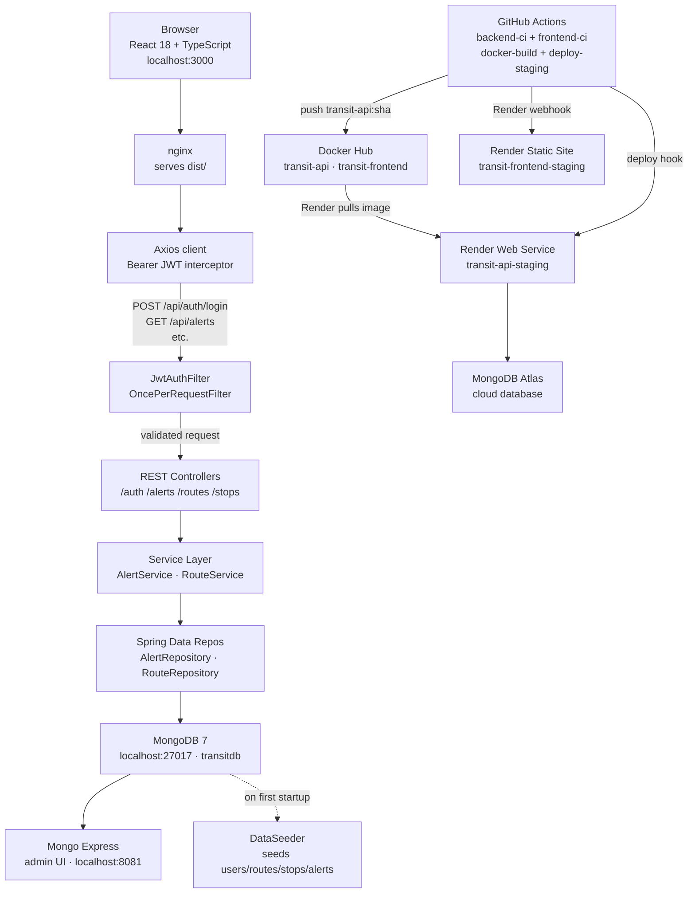

# New Hire Exploration Guide

> Transit Alert Dashboard — Day-One Walkthrough
> Auto-generated from workspace: `transit-alert-dashboard`

---

## 0. What Is This Project?

Transit Alert Dashboard is an internal operations tool for transit agency staff. Operators log in and see a live count of active service disruptions across the route network. They can create new alerts — for example, a signal failure causing bus delays on a specific route — and mark them resolved once the issue is cleared. Managers and dispatchers with a Viewer or Admin role can browse the route list, monitor alert history, and see a summary dashboard at a glance. The application is built with a Java Spring Boot backend that serves a REST API, a React 18 TypeScript frontend that talks to that API, and MongoDB as the database. Everything runs locally with a single Docker Compose command, and changes to the `main` branch are automatically tested and deployed to a cloud staging environment via GitHub Actions CI/CD.

---

## 1. Quick Start (Everything Up in One Command)

### Prerequisites

- Docker Desktop running
- Ports 3000, 8080, 8081, and 27017 free

### First-time setup

```bash
# Clone the repo and enter the project folder
cd ~/projects/transit-alert-dashboard

# Copy the env template (only needed once)
cp .env.example .env

# Build images and start all four services
docker compose up --build
```

> First build takes 2–3 minutes while Maven downloads dependencies and compiles the JAR.
> Subsequent starts (without `--build`) take about 30 seconds.

### Service Map

| Service | URL | What You Will See |
|---|---|---|
| **Frontend** | http://localhost:3000 | React SPA — login page on first visit |
| **Backend API** | http://localhost:8080/api | Spring Boot REST API (returns JSON) |
| **Swagger UI** | http://localhost:8080/swagger-ui.html | Interactive API explorer with Try It Out |
| **Actuator Health** | http://localhost:8080/api/actuator/health | `{"status":"UP"}` — no auth required |
| **Mongo Express** | http://localhost:8081 | Database admin UI (user: `admin` / pass: `changeme`) |

### Stopping the stack

```bash
docker compose down            # stop containers, keep the mongo-data volume
docker compose down -v         # stop containers AND delete the database volume (full reset)
```

### Demo Credentials

| Role | Email | Password | Can Do |
|---|---|---|---|
| Admin | admin@transit.demo | demo1234 | Everything including delete |
| Operator | operator@transit.demo | demo1234 | Create and resolve alerts |
| Viewer | viewer@transit.demo | demo1234 | Read-only access |

---

## 2. Explore the Frontend

### Landing page

Open http://localhost:3000 — you are redirected to `/login` automatically because you don't have a JWT token yet.

### Logging in

Enter `operator@transit.demo` / `demo1234` and click **Sign In**. A successful login:
- Calls `POST /api/auth/login` and receives a JWT token plus your name and role
- Stores the token in `localStorage`
- Redirects you to `/dashboard`

### Pages to visit in order

**1. Dashboard (`/dashboard`)**
Two summary cards showing total **ACTIVE** and **RESOLVED** alert counts. The counts come from `GET /api/alerts/summary` — a lightweight aggregation endpoint, not a full list query.

**2. Alerts list (`/alerts`)**
A paginated table of all service alerts. Notice:
- The **Status** dropdown filters by ACTIVE or RESOLVED
- Each row shows the severity badge (red = HIGH, yellow = MEDIUM, blue = LOW) and status badge
- The **Resolve** button sends `PATCH /api/alerts/{id}/resolve` and the list refreshes automatically via React Query cache invalidation
- Try resolving an alert and watch it disappear from the ACTIVE filter

**3. Create Alert (`/alerts/new`)**
A form with title, description, severity, and a route dropdown. Fill it in and submit — the new alert appears at the top of the list (sorted by `createdAt DESC`). The route dropdown is populated from `GET /api/routes/active`.

**4. Alert Detail (`/alerts/:id`)**
Click any alert row to see full details including the route name, creator email, timestamps, and a Resolve button.

**5. Routes list (`/routes`)**
A table of transit routes (routeNumber, name, type, active status). Route 14 (Mission Express) is seeded as inactive — notice the different badge styling.

### Where the frontend source lives

```
frontend/src/
├── api/
│   ├── client.ts        ← Axios instance: JWT interceptor + 401 redirect
│   └── index.ts         ← Typed API functions for alerts, routes, auth
├── context/
│   └── AuthContext.tsx  ← Global auth state (token, fullName, role)
├── pages/               ← One file per route
│   ├── LoginPage.tsx
│   ├── DashboardPage.tsx
│   ├── AlertsPage.tsx
│   ├── AlertDetailPage.tsx
│   ├── CreateAlertPage.tsx
│   └── RoutesPage.tsx
├── components/
│   ├── Layout.tsx        ← Nav bar + page wrapper
│   ├── ProtectedRoute.tsx← Redirects unauthenticated users to /login
│   └── AlertStatusBadge.tsx
└── types/
    └── index.ts          ← TypeScript interfaces mirroring backend DTOs
```

### Storybook — component explorer

Storybook is available for isolated component development and visual documentation.

```bash
cd frontend
npm run storybook    # starts at http://localhost:6006
```

Stories to look at first:
- **Components/AlertStatusBadge** — five stories showing all status and severity badge variants

> Storybook is not included in the Docker Compose stack. Run it separately with `npm run storybook` from the `frontend/` directory.

---

## 3. Explore the Backend API

### Open Swagger UI

Go to http://localhost:8080/swagger-ui.html

All endpoints except `/auth/login` and `/actuator/health` require a Bearer token.

### Step 1 — Get a token

In Swagger UI, find `POST /auth/login` → click **Try it out** → paste this body:

```json
{
  "email": "operator@transit.demo",
  "password": "demo1234"
}
```

Copy the `token` value from the response.

### Step 2 — Authorize

Click the **Authorize** button (top right in Swagger UI), paste `Bearer <your-token>` into the value field, and click Authorize. All subsequent requests include the token.

### Endpoints to try (in this order)

| # | Endpoint | What To Send | What To Look For |
|---|---|---|---|
| 1 | `GET /api/actuator/health` | nothing | `{"status":"UP"}` — no auth needed; this is what CI polls |
| 2 | `GET /api/alerts/summary` | nothing | `{"ACTIVE": N, "RESOLVED": M}` — powers the dashboard cards |
| 3 | `GET /api/alerts` | query params: `status=ACTIVE&page=0&size=5` | Paginated `Page<Alert>` with `content`, `totalElements`, `totalPages` |
| 4 | `GET /api/routes` | nothing | All 5 seeded routes including the inactive Route 14 |
| 5 | `POST /api/alerts` | body below | Returns `201 Created` with `Location` header pointing to the new alert |
| 6 | `GET /api/alerts/{id}` | the id from step 5 | Full alert document |
| 7 | `PATCH /api/alerts/{id}/resolve` | the id from step 5 | Updated alert with `status: RESOLVED` and `resolvedAt` timestamp |

**Body for `POST /api/alerts` (step 5):**
```json
{
  "title": "Test disruption from Swagger",
  "description": "Exploring the API on day one",
  "severity": "LOW",
  "affectedRouteId": "<paste a route id from step 4>"
}
```

**Try a validation error:** Submit `POST /api/alerts` with `"title": ""` — you should get a structured `400 Bad Request` response from `GlobalExceptionHandler`:
```json
{
  "status": 400,
  "detail": "title: must not be blank"
}
```

**Try an auth error:** Remove the Authorization header and call any protected endpoint — you should get `401 Unauthorized`.

### Where the controller source lives

```
backend/src/main/java/com/transitdemo/
├── auth/
│   └── AuthController.java     ← POST /auth/login
├── alerts/
│   └── AlertController.java    ← GET/POST/PATCH/DELETE /alerts
├── routes/
│   └── RouteController.java    ← GET/POST/PUT/DELETE /routes
└── stops/
    └── StopController.java     ← GET /routes/{id}/stops
```

---

## 4. Explore the Database

### Open Mongo Express

Go to http://localhost:8081

Log in with **admin** / **changeme** (set in `.env` via `ME_USER` / `ME_PASS`).

Navigate to **transitdb** in the left sidebar to see all collections.

### Collections and what they store

| Collection | What It Stores |
|---|---|
| `users` | Operator accounts — email, BCrypt-hashed password, fullName, role (ADMIN/OPERATOR/VIEWER) |
| `routes` | Transit routes — routeNumber (unique), name, type (BUS/METRO/TRAM/FERRY), active flag |
| `stops` | Individual stops on a route — routeId reference, stopCode, name, lat/lon, sequenceOrder |
| `alerts` | Service disruptions — title, description, severity, status, affectedRouteId, affectedRouteName, createdByEmail, timestamps |

### Queries to understand the data shape

```javascript
// In Mongo Express: click the "FIND" tab on each collection

// See all active alerts sorted newest first
db.alerts.find({ status: "ACTIVE" }).sort({ createdAt: -1 })

// See users (passwords are BCrypt hashes — never plaintext)
db.users.find({}, { password: 0 })

// See all stops for Route 22 (Mission Street)
db.routes.findOne({ routeNumber: "22" })
// copy the _id, then:
db.stops.find({ routeId: "<route-22-id>" }).sort({ sequenceOrder: 1 })

// Check the compound index on alerts
db.alerts.getIndexes()
// You should see: status_route_created_idx on { status, affectedRouteId, createdAt }
```

### Where seed data comes from

All demo data is seeded on first startup by `DataSeeder.java`:

```
backend/src/main/java/com/transitdemo/common/DataSeeder.java
```

It seeds: 3 users, 5 routes, 6 stops (on routes 22 and N), and 3 alerts (1 HIGH, 1 MEDIUM, 1 LOW). The seeder checks `if (userRepository.count() > 0)` before running — so it is safe to restart the container without re-seeding.

**To reset to a clean slate:**
```bash
docker compose down -v   # deletes the mongo-data volume
docker compose up        # DataSeeder re-seeds on startup
```

### No migration files

This project uses Spring Data MongoDB with `DataSeeder` for initial data. There are no Flyway/Liquibase migration files — schema changes are handled directly in the Java entity classes. The `@CompoundIndex` annotation on `Alert.java` creates the database index automatically when the app starts.

---

## 5. Explore the CI/CD Pipeline

### CI/CD tool

**GitHub Actions** — pipeline file: `.github/workflows/ci.yml`

### Pipeline structure

```
git push to any branch
        │
        ├── backend-ci  ─────────────────────────────────────────────┐
        │   Java 21 / Maven                                          │
        │   1. Checkout                                               │
        │   2. Set up JDK 21 (Temurin) with Maven cache              │
        │   3. mvn verify  ← runs all JUnit tests                    │
        │   4. Upload Surefire XML reports (even on failure)          │
        │                                                             ├── docker-build ──── deploy-staging
        ├── frontend-ci ────────────────────────────────────────────┘     (main only)        (main only)
            Node 20 / Vite
            1. Checkout
            2. Set up Node 20 with npm cache
            3. npm ci
            4. npm run lint  ← tsc --noEmit (type-check)
            5. npm test      ← vitest run
            6. npm run build ← catches bundler errors
```

The `docker-build` and `deploy-staging` jobs only run when both test jobs pass **and** the branch is `main`.

### docker-build job

Builds and pushes two Docker images to Docker Hub:
- `cannguyen312/transit-api:latest` + `:sha`
- `cannguyen312/transit-frontend:latest` + `:sha`

The `:sha` tag provides a rollback target — if `latest` regreses, you can redeploy the specific SHA-tagged image from Render's dashboard.

### deploy-staging job

1. Fires the Render staging deploy hook (HTTP POST)
2. Polls `https://transit-api-staging.onrender.com/api/actuator/health` every 10 seconds for up to 3 minutes
3. If the service doesn't respond with `200 OK` within 18 attempts, the job fails and the pipeline goes red

**Staging URLs:**
- Frontend: https://transit-frontend-staging.onrender.com
- Backend API: https://transit-api-staging.onrender.com/api

### Reading a pipeline run

Go to https://github.com/chutieu312/transit-alert-dashboard/actions

- Green checkmark = all jobs passed, staging is healthy
- Red X = check the failed job's log for the failing test name or health check output
- Download Surefire XML reports from the **Artifacts** section of a backend-ci run to see JUnit failure details

### How to trigger manually

Any push to `main` or a PR targeting `main` triggers the full pipeline.
To trigger just the deploy without a code change: use the Render Dashboard → Manual Deploy.

### Required secrets (GitHub repository secrets)

| Secret | Used By |
|---|---|
| `DOCKERHUB_USERNAME` | docker-build — tags the images |
| `DOCKERHUB_TOKEN` | docker-build — authenticates push to Docker Hub |
| `RENDER_STAGING_DEPLOY_HOOK` | deploy-staging — triggers the Render redeploy |

---

## 6. Explore Cloud Services

This project uses **real cloud services** in staging, not a local emulator.

| Service | Provider | What It Does |
|---|---|---|
| Backend Web Service | Render.com | Runs the Spring Boot Docker container on every `main` deploy |
| Static Site | Render.com | Builds and serves the React frontend from GitHub source |
| Database | MongoDB Atlas (M0 free tier) | Cloud-hosted MongoDB — `cluster0.gn3ldab.mongodb.net`, database `transitdb` |
| Container Registry | Docker Hub | Stores `transit-api` and `transit-frontend` images; Render pulls from here |

**No local cloud emulator is used.** There are no AWS/GCP/Azure SDK dependencies in this project. All backend logic reads from MongoDB directly via Spring Data.

### How a deploy flows end-to-end

1. Push to `main` → GitHub Actions runs tests
2. Tests pass → GitHub Actions builds Docker image and pushes to Docker Hub
3. GitHub Actions fires Render deploy hook → Render pulls `transit-api:latest`
4. Simultaneously, Render detects the GitHub push via webhook → rebuilds the static frontend from source
5. CI polls `/actuator/health` until the new backend container is healthy

### Render environment variables (staging)

These are set in the Render Dashboard → **transit-api-staging → Environment**:

| Variable | What It Controls |
|---|---|
| `MONGODB_URI` | Atlas connection string with credentials |
| `JWT_SECRET` | HMAC-SHA256 signing key for JWTs |
| `FRONTEND_URL` | Staging frontend URL for CORS whitelist |
| `PORT` | Set by Render automatically; Spring reads it via `${PORT:8080}` |

---

## 7. Run the Tests

### Test commands

| Test Type | Command | What It Tests | Where the Files Are |
|---|---|---|---|
| Backend unit tests | `cd backend && mvn verify` | AlertService business logic (create, resolve, idempotency, summary, filter) via Mockito mocks | `backend/src/test/java/com/transitdemo/alerts/AlertServiceTest.java` |
| Frontend type-check | `cd frontend && npm run lint` | TypeScript types across all components and API functions | All `*.ts` / `*.tsx` files |
| Frontend unit tests | `cd frontend && npm test` | LoginPage behavior, AlertStatusBadge rendering, badge color classes | `frontend/src/test/` |
| Storybook visual | `cd frontend && npm run storybook` | Component stories — AlertStatusBadge variants | `frontend/src/stories/` |

### Run all tests with one command (in Docker)

```bash
# Backend only — inside the container
docker compose exec backend mvn verify

# Or locally (faster, no Docker needed):
cd backend && mvn verify
cd frontend && npm ci && npm test
```

### Test files worth reading

**1. `backend/src/test/java/com/transitdemo/alerts/AlertServiceTest.java`**
The most important backend test file. Read this to understand:
- How `create()` sets status to ACTIVE, copies route name, stamps creator email
- How `resolve()` sets `resolvedAt` and is idempotent (never calls `save()` twice)
- How Mockito mocks replace the real MongoDB repositories in unit tests

**2. `frontend/src/test/LoginPage.test.tsx`**
The most important frontend test file. Read this to understand:
- How React Testing Library simulates real user actions (`userEvent.type`, `userEvent.click`)
- How the `AuthContext` is mocked with `vi.fn()` for controlled test scenarios
- How `waitFor` handles async state updates after user interactions

**3. `frontend/src/test/AlertStatusBadge.test.tsx`**
Simple but reveals the testing philosophy: test what the user sees (text content, CSS classes), not how the component manages state internally.

---

## 8. Understand the Architecture



### Component descriptions

| Component | One-sentence description |
|---|---|
| **React SPA (Vite)** | Six-page TypeScript frontend with TanStack React Query for server state and React Router 6 for client-side navigation |
| **Axios client** | Single shared HTTP instance that injects the JWT Bearer token on every request and redirects to `/login` on `401` |
| **nginx** | Serves the compiled `dist/` bundle in the Docker container; proxies unknown paths back to `index.html` for client-side routing |
| **JwtAuthFilter** | `OncePerRequestFilter` that validates the HMAC-SHA256 token and populates `SecurityContextHolder` before every request reaches a controller |
| **SecurityConfig** | Configures the Spring Security filter chain: CORS allowlist, stateless session, public endpoints, and BCrypt password encoding |
| **AlertController** | REST handler for CRUD + resolve + summary on the alerts collection |
| **AlertService** | Business logic: validates route exists, reads creator from security context, enforces idempotent resolve |
| **AlertRepository** | `MongoRepository` with derived query methods for status/routeId filters, pagination, counts, and top-5 queries |
| **MongoDB 7** | Document database storing users, routes, stops, and alerts; alerts have a compound index on `(status, affectedRouteId, createdAt)` |
| **Mongo Express** | Browser-based admin UI to browse and query collections — useful for debugging data during development |
| **DataSeeder** | Seeds 3 users, 5 routes, 6 stops, and 3 alerts on first startup; idempotent (skips if data already exists) |
| **GitHub Actions** | 4-job CI/CD pipeline: parallel test jobs → Docker build & push → Render deploy with health check gate |

---

## 9. Key Source Code Tour

| File | Why It Matters |
|---|---|
| `backend/src/main/java/com/transitdemo/auth/SecurityConfig.java` | Entry point for all Spring Security configuration — CORS origins, public vs protected URLs, stateless session, JWT filter wiring, BCrypt encoder |
| `backend/src/main/java/com/transitdemo/auth/JwtAuthFilter.java` | Every authenticated request flows through here — extracts Bearer token, validates signature, sets `SecurityContextHolder` |
| `backend/src/main/java/com/transitdemo/auth/JwtService.java` | JWT generation and validation — where the signing key is built and token claims are set |
| `backend/src/main/java/com/transitdemo/alerts/AlertService.java` | Core business logic — create (with route validation + creator stamping), resolve (idempotent), summary counts |
| `backend/src/main/java/com/transitdemo/common/GlobalExceptionHandler.java` | All API error responses flow through here — maps each exception type to an RFC 7807 `ProblemDetail` response |
| `backend/src/main/java/com/transitdemo/common/DataSeeder.java` | Seeds demo data on startup — the best single file to understand the full data model at a glance |
| `backend/src/main/resources/application.yml` | All configuration in one place — ports, MongoDB URI, JWT secret, Actuator exposure, Swagger paths, log levels |
| `frontend/src/api/client.ts` | Axios instance with JWT interceptor and 401 redirect — the single integration point between React and the backend |
| `frontend/src/context/AuthContext.tsx` | Global auth state management — login/logout, localStorage persistence, `isAuthenticated` flag consumed by `ProtectedRoute` |
| `frontend/src/pages/AlertsPage.tsx` | The most feature-rich page — demonstrates `useQuery` with filter/pagination, `useMutation` with cache invalidation, and conditional rendering |
| `.github/workflows/ci.yml` | The complete CI/CD pipeline — read this to understand the full test → build → deploy lifecycle and how each job depends on the others |
| `docker-compose.yml` | The local environment definition — shows how all four services are wired together with health checks, volumes, and environment variables |

---

## 10. Things to Ask Your Team

These questions cannot be answered from the code alone:

1. **Where are the production secrets stored and who rotates them?**
   The staging secrets are in Render's environment variable UI. Is there a production environment? If so, are secrets managed in AWS Secrets Manager, Vault, or another secrets store? Who is on the rotation schedule for the JWT signing key and MongoDB credentials?

2. **What is the process for a hotfix deploy?**
   The current pipeline only deploys from `main`. If a bug reaches staging and needs an immediate fix, what is the procedure — direct push to `main`, a hotfix branch, or a manual Render deploy from a specific Docker image SHA?

3. **Are there any known flaky tests or tests being skipped?**
   The `AlertServiceTest` comment references Testcontainers with `@ServiceConnection` for integration tests, but no integration tests are implemented yet. Is that intentional? Are there any `@Disabled` or `@Ignore` annotations on tests in other parts of the codebase?

4. **What is the plan for the missing stops UI?**
   The `stops` collection and `StopController` exist in the backend but there is no stops page in the frontend. Is this a planned feature, deprioritized, or abandoned?

5. **How should JWT token expiry be handled in production?**
   Tokens expire after 1 hour (configurable in `application.yml`). The current implementation has no token refresh endpoint — users are redirected to login after expiry. Is a refresh token flow planned, and if so, how will refresh tokens be stored securely?

6. **What is the MongoDB Atlas backup and recovery policy?**
   The M0 free tier has no backup snapshots. If this project moves to a paid tier, what is the recovery point objective (RPO) and recovery time objective (RTO)?

7. **Who reviews pull requests and what is the merge policy?**
   The pipeline gates `main` on passing CI, but is there a required reviewer count? Are there any branch protection rules beyond CI checks?

8. **Is the `14 Mission Express` route being inactive intentional?**
   Route 14 is seeded as `active: false`. Is this modeling a real business concept (deactivated routes stay in the database for alert history), or is it a placeholder for a future feature?

---

## 11. Day-One Checklist

- [ ] Copy `.env.example` to `.env`
- [ ] Run `docker compose up --build` and see all four containers start successfully
- [ ] Visit http://localhost:3000 and confirm you are redirected to the login page
- [ ] Log in as `operator@transit.demo` / `demo1234` and see the Dashboard with alert counts
- [ ] Visit `/alerts`, filter by `ACTIVE`, and resolve one alert — confirm the count updates
- [ ] Visit `/alerts/new`, create a new alert, and confirm it appears in the list
- [ ] Open http://localhost:8080/swagger-ui.html, authenticate, and call `GET /api/alerts/summary`
- [ ] Open http://localhost:8081 and browse the `alerts` and `users` collections in Mongo Express
- [ ] Run the backend tests: `cd backend && mvn verify` — all 6 tests should pass
- [ ] Run the frontend tests: `cd frontend && npm test` — all 8 tests should pass
- [ ] Run Storybook: `cd frontend && npm run storybook` — open http://localhost:6006 and view the AlertStatusBadge stories
- [ ] Read `.github/workflows/ci.yml` end-to-end and trace the path from `git push` to staged deployment
- [ ] Read `AlertService.java`, `JwtAuthFilter.java`, and `AuthContext.tsx` — the three files that unlock the auth and business logic of the whole system
