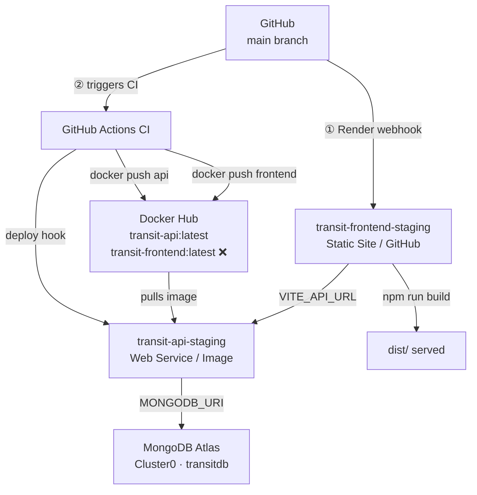
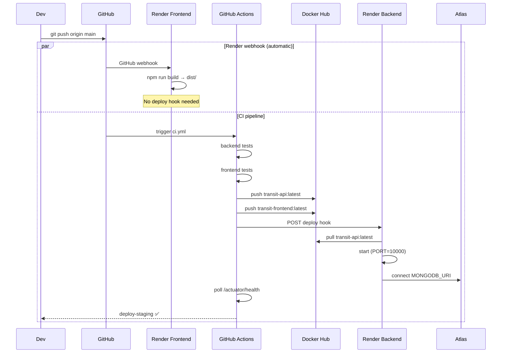
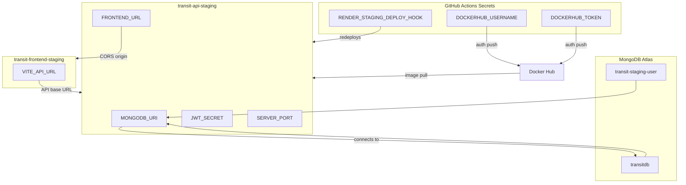

# Staging Infrastructure Setup Guide

This guide documents the complete setup of the `transit-alert-dashboard` staging environment, covering Render services and MongoDB Atlas, and the relationships between them.

---

## Architecture Overview



> **Two independent deploy triggers fire on every `git push origin main`:**
>
> | Trigger | What deploys | How |
> |---|---|---|
> | **Render GitHub webhook** (auto-installed when the Static Site was created) | `transit-frontend-staging` | Render clones the repo and runs `npm install && npm run build` directly — no CI involvement, no deploy hook needed |
> | **GitHub Actions CI** (`RENDER_STAGING_DEPLOY_HOOK`) | `transit-api-staging` | CI must first build and push the Docker image to Docker Hub, then fires the deploy hook so Render can pull the new image |
>
> The CI builds and pushes `cannguyen312/transit-frontend:latest` to Docker Hub as well, but **nothing consumes it in staging** — it exists for potential future use (e.g., a containerised environment).

---

## 1. MongoDB Atlas Setup

### 1.1 Cluster

| Field | Value |
|---|---|
| Provider | MongoDB Atlas (Free Tier) |
| Cluster Name | `Cluster0` |
| Tier | M0 (Free) |
| Region | AWS / us-east-1 (default) |
| Host | `cluster0.gn3ldab.mongodb.net` |
| Database | `transitdb` |

### 1.2 Database User

Navigate to **Security → Database Access → Add New Database User**:

| Field | Value |
|---|---|
| Username | `transit-staging-user` |
| Authentication | Password (SCRAM) |
| Role | `readWriteAnyDatabase@admin` |

> The password is stored as the `MONGODB_URI` secret in Render (see §3.1).

### 1.3 Network Access

Navigate to **Security → Network Access → Add IP Address**:

| CIDR | Comment |
|---|---|
| `0.0.0.0/0` | Allow all IPs for Render deployment |

> Render does not provide static outbound IPs on the Free tier, so `0.0.0.0/0` is required.

### 1.4 Connection String

The full connection URI used by the backend:

```
mongodb+srv://transit-staging-user:<password>@cluster0.gn3ldab.mongodb.net/transitdb?retryWrites=true&w=majority&appName=Cluster0
```

---

## 2. Render: `transit-api-staging` (Backend Web Service)

### 2.1 Service Configuration

| Field | Value |
|---|---|
| Service Type | Web Service |
| Source | Docker image (image-based deploy) |
| Image | `docker.io/cannguyen312/transit-api:latest` |
| Service ID | `srv-d8g787d7vvec739s2v7g` |
| URL | `https://transit-api-staging.onrender.com` |
| Region | Oregon (US West) |
| Instance Type | Free |
| Health Check Path | `/api/actuator/health` |

> **Port note:** Render injects `PORT=10000` into image-based web services regardless of the `EXPOSE` value in the Dockerfile. The Spring Boot app must read this via `server.port: ${PORT:8080}` in `application.yml`.

### 2.2 Environment Variables

| Key | Value | Purpose |
|---|---|---|
| `SERVER_PORT` | `10000` | Explicit fallback — ensures Spring Boot binds to Render's expected port |
| `MONGODB_URI` | `mongodb+srv://transit-staging-user:<password>@cluster0.gn3ldab.mongodb.net/transitdb?retryWrites=true&w=majority&appName=Cluster0` | Atlas connection string for the `transitdb` database |
| `JWT_SECRET` | `transit-staging-super-secret-jwt-key-2024!XYZ` | Secret used to sign/verify JWTs (min 32 chars) |
| `FRONTEND_URL` | `https://transit-frontend-staging.onrender.com` | Injected into CORS config (`SecurityConfig.java`) via `${FRONTEND_URL}` |

### 2.3 Deploy Hook

Render provides a deploy hook URL to trigger redeploys externally:

```
https://api.render.com/deploy/srv-d8g787d7vvec739s2v7g?key=<key>
```

This URL is stored as the GitHub Actions secret `RENDER_STAGING_DEPLOY_HOOK` and is called at the end of the `deploy-staging` job in CI.

---

## 3. Render: `transit-frontend-staging` (Static Site)

### 3.1 Service Configuration

| Field | Value |
|---|---|
| Service Type | **Static Site** (GitHub source — not Docker Hub) |
| Source | GitHub repository (auto-deploy on push to `main`) |
| Repository | `chutieu312/transit-alert-dashboard` |
| Branch | `main` |
| URL | `https://transit-frontend-staging.onrender.com` |
| Root Directory | `frontend` |
| Build Command | `npm install && npm run build` |
| Publish Directory | `dist` |

> Render clones the GitHub repo, runs the build command inside `frontend/`, and serves the resulting `dist/` folder as a CDN-backed static site. It does **not** use the `cannguyen312/transit-frontend` Docker Hub image.

### 3.2 Environment Variables

| Key | Value | Purpose |
|---|---|---|
| `VITE_API_URL` | `https://transit-api-staging.onrender.com/api` | Base URL injected at Vite build time via `import.meta.env.VITE_API_URL` |

> This is a **build-time** variable. Vite bakes it into the static bundle during `npm run build`. Changing this value requires a redeploy.

---

## 4. GitHub Actions Integration

### 4.1 Required Secrets

Navigate to **GitHub → Repository Settings → Secrets and variables → Actions**:

| Secret | Description |
|---|---|
| `DOCKERHUB_USERNAME` | Docker Hub username (`cannguyen312`) — used to push `transit-api` image |
| `DOCKERHUB_TOKEN` | Docker Hub access token — authenticates the push |
| `RENDER_STAGING_DEPLOY_HOOK` | Full Render deploy hook URL — triggers `transit-api-staging` redeploy after a new image is pushed |

### 4.2 CI/CD Flow



---

## 5. Environment Variable Relationships



---

## 6. Key Files in the Codebase

| File | Relevant Config |
|---|---|
| `backend/src/main/resources/application.yml` | `server.port: ${PORT:8080}` — reads Render's `PORT` env var |
| `backend/.../auth/SecurityConfig.java` | `${FRONTEND_URL:http://localhost:3000}` — CORS origin from env |
| `frontend/src/api/client.ts` | `import.meta.env.VITE_API_URL ?? '/api'` — API base URL from env |
| `.github/workflows/ci.yml` | `deploy-staging` job: pushes image, fires hook, polls health check |

---

## 7. Redeployment Cheatsheet

| Scenario | Action |
|---|---|
| Push code changes | `git push origin main` → CI auto-runs everything |
| Update a backend env var | Render dashboard → transit-api-staging → Environment → Edit → Save and deploy |
| Rotate MongoDB password | Atlas → Database Access → Edit user → Update password → Update `MONGODB_URI` in Render |
| Roll back backend | Render dashboard → transit-api-staging → Events → select previous deploy → Rollback |
| Force redeploy frontend | Render dashboard → transit-frontend-staging → Manual Deploy → Deploy latest commit |
